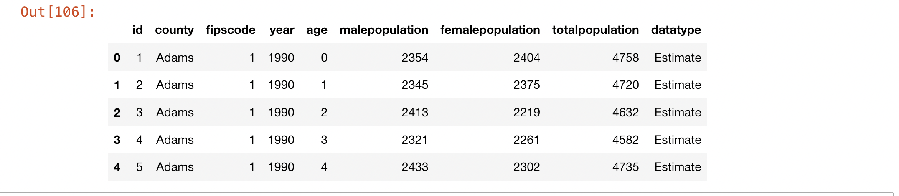

Retrieving Data from APIs
===========================

|

**What is an API?**

APIs are mechanisms that enable two software components to communicate with each other using a set of definitions and protocols.  Many organizations now make their data available via API. Web-based can access this data and use them visualization or analysis. 

There are many different types of web APIs. One of the most common types is a REST API.  This type of API uses URL arguments to specify what information should be returned via the API.

|

**API Endpoints**

When working with APIs, you will frequently hear the term "endpoint".  The API endpoint refers to the dataset that is being retrieved by the API's URL.  These data may be in the form of census data, geospatial base maps, elevation data or any type of data that has been made available through the API. As an example, let's look at the Colorado Information Marketplace which is a data warehouse that provides access to a wide range of Colorado-specific open datasets available via a REST API called the Socrata Open Data API (SODA) - https://data.colorado.gov/browse

There are lots of API endpoints or data sets available through this API.  Click on this link to see the response that you get from using a browswer to make a basic request with no URL parameters specified: https://data.colorado.gov/resource/tv8u-hswn.json. Notice that the response in this case is returned in JSON format.

|

**Retrieving Data Using Python**

Instead of using the browser to view the json file at the API endpoint, we can use Python to make a call to the API, retreive the data, and view the data.  The script below illustrates how this works:

.. code-block:: python

	import requests
	import json

	colorado_data  = requests.get("https://data.colorado.gov/resource/tv8u-hswn.json")

	print (colorado_data.json())

.. image:: img/colorado_dataset1.png
   :alt: Aspect Map

The output from the above script is a json object. Although this is a human readable format, we can use the pandas library to format the json and display it in a more user-friendly way.  The code sample below shows how this can be done. 

.. code-block:: python

	import requests
	import json
	import pandas as pd

	url = "https://data.colorado.gov/resource/tv8u-hswn.json"

	colorado_data  = pd.read_json(url)

	colorado_data.head()

|

**Downloading Json and Mapping the Data Points**

As GIS researchers, we are also interested in mapping lat\long coordinates that may be contained in API endpoints.  the script takes a json string, parses it and extracts the latitude/longitde data.

.. code-block:: python

	import requests
	import json
	import folium

	# Make a GET request to the API endpoint
	response = requests.get("https://example.com/api")

	# Parse the response content as JSON
	data = json.loads(response.content)

	# Extract the latitude and longitude from the JSON data
	latitude = data['latitude']
	longitude = data['longitude']

	# Create a map using the extracted latitude and longitude
	map = folium.Map(location=[latitude, longitude], zoom_start=12)

	# Add a marker to the map at the extracted latitude and longitude
	folium.Marker([latitude, longitude]).add_to(map)

	# Display the map
	map

.. code-block:: python

	import json

	# JSON data containing latitude and longitude
	json_data = '{"location": {"latitude": 40.7128, "longitude": -74.006}}'

	# Parse the JSON data as a Python object
	data = json.loads(json_data)

	# Extract latitude and longitude from the Python object
	latitude = data['location']['latitude']
	longitude = data['location']['longitude']

	# Print the latitude and longitude values
	print("Latitude: ", latitude)
	print("Longitude: ", longitude)

|

**Mapping with Python & Folium - Creating Maps from Raw CSV/JSON Data**

This video is a tutorial on how to create Folium maps from raw CSV data in Python. The video covers loading the data into Python, transforming the data, extracting latitude/longitude, and creating interactive maps based on the data.

.. raw:: html

    <iframe width="560" height="315" src="https://www.youtube.com/embed/H8Ypb8Ei9YA" title="YouTube video player" frameborder="0" allow="accelerometer; autoplay; clipboard-write; encrypted-media; gyroscope; picture-in-picture; web-share" allowfullscreen></iframe>

|

**Geocoding Using the OpenStreetMap Nominatim API**

Python script that uses the OpenStreetMap Nominatim API to geocode an address, retrieve a JSON response, parse the JSON response, and print out the latitude and longitude coordinates.

.. code-block:: python

	import requests
	import json

	# Define the address to geocode
	address = input("Enter the address of interest ")

	#address = "1600 Pennsylvania Avenue NW, Washington, DC 20500, USA"

	# Build the URL for the Nominatim API request
	url = f"https://nominatim.openstreetmap.org/search?q={address}&format=json"

	# Make a GET request to the Nominatim API
	response = requests.get(url)

	# Parse the JSON response
	data = json.loads(response.content)

	# Extract the latitude and longitude coordinates from the response
	latitude = data[0]['lat']
	longitude = data[0]['lon']

	# Print the latitude and longitude coordinates
	print(f"Latitude: {latitude}")
	print(f"Longitude: {longitude}")

|

**Readings**

API’s and Natural Language Processing in Open Source Python
https://www.earthdatascience.org/courses/use-data-open-source-python/intro-to-apis/

https://www.artlembo.com/post/parallel-processing-with-gis-on-desktop-pcs?utm_campaign=2023-05-05&utm_term=16905998&utm_content=educational&utm_source=email-sendgrid&utm_medium=649690

**URL Parameters**

Using URL parameters, you can define a more specific request to limit what data you get back in response to your API request. For example, you can query the data to only return data for Boulder County, Colorado using the REST API call.

Pay close attention to the ?&county=Boulder part of the url below. That's the part of the API request that tells the API to only return a subset of the data - where county = Boulder. https://data.colorado.gov/resource/tv8u-hswn.json?&county=Boulder. 

https://amaral.northwestern.edu/blog/getting-long-lat-list-cities

