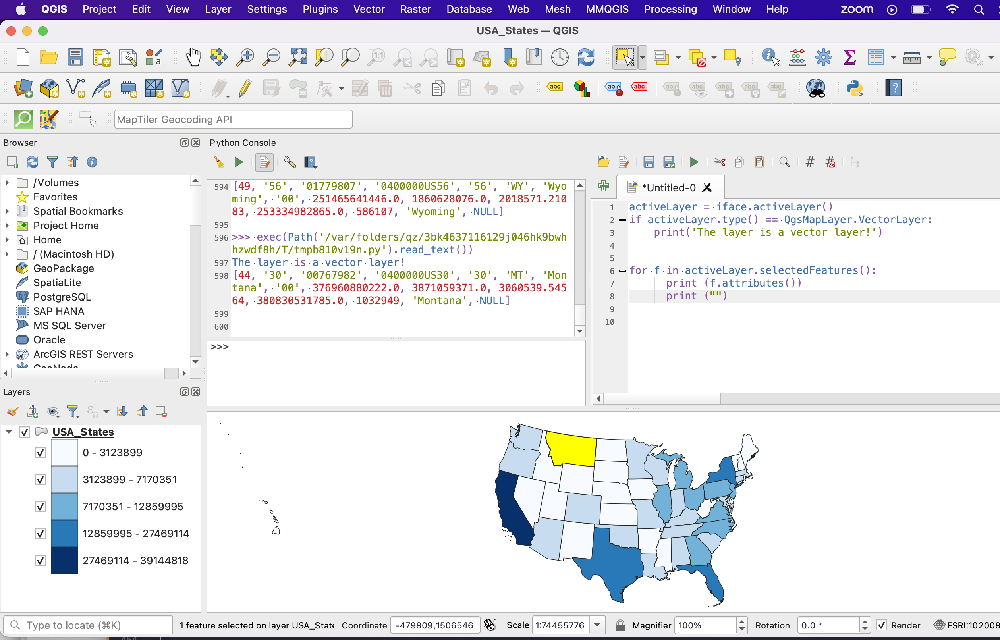

Conditional Statements and Looping
=====================================

|

Conditionals 
------------

Unless otherwise directed, lines of codes in a procedure run sequentially, from first to last. Conditional statements can change the sequential flow of a program based on whether a given condition is true or false.

Python uses the If statement for testing conditions. If the condition is true, then the code block following the if statement is executed. If it is not true, the program jumps to the end of the code block.

In Python, a colon is placed at the end of the conditional statement, and the lines below the condition statement are indented. 

There are three types of conditional structures in Python:

    | – if ..
    | – if.. else
    | – if ..elif .. else

|

**The If.. Conditional Structure**

The structure of the if .. conditional statement is shown below.  

 
.. code-block:: python
   :linenos:

   if condition:  # if the variable is defined
       execute statement

If the condition is true, that is, if the variable is defined, then the block following will be executed. An example of the structure is shown below.

.. code-block:: python
   :linenos:

   var1 = "blue"
   if  var1:
      print ("The sky is blue.")

Here is a another example involving the if statement.

.. code-block:: python
   :linenos:

    number = 10
    if number > 0:
    print('Number is', number)

|

The code sample below contains an if statement and should be run in QGIS.  It tests whether the active layer in the Table of Content is a vector layer. In the code sample, the iface object is used to retrieve the active layer in the Canvas. Once the active layer is retrieved, the code checks if it is a vector layer. If it is vector layer, then it prints a message indicating that the layer is a vector layer.   

.. code-block:: python
   :linenos:

   activeLayer = iface.activeLayer()
   if activeLayer.type() == QgsMapLayer.VectorLayer: 
      print('The layer is a vector layer!')

To run the code, look at the numbered elements in the illustration below.  First, click on Plugin in the main menu, then click on Python Console. When the Python Console opens, click on the Show Editor button and paste the code into the Editor.  Next, click the Save button then run the code by clicking on the green player button. 
 
.. image:: img/activeLayer.png
   :alt: Display Active Layer

|

**The If.. Else Conditional Structure**

The if-else statement is designed to execute what follows after either the true part or false part of a condition.  If the condition evaluates to true, then the if block code is executed.  If the condition is false, the else block code is executed.

.. code-block:: python
   :linenos:

   if condition:  # if condition is true.
       execute this statement
   else:
        execute this statement

Here is an example of the if .. else statement.

.. code-block:: python
   :linenos:

   answer = int (input("Please enter a number: "))
   if answer == 15:
       print ("The number " + str(answer) + " is my lucky number.")
   else:
       print (The number " + str(answer) + " is not my lucky number.")
 
|

Here is another example of the use of an if .. else statement.

.. code-block:: python
   :linenos:

   x =  int(input ("Please enter a number between 0 and 100: "))

   if x%2 == 0:
       print('{} is divisible by 2'.format(x))
   else:
       print('{} is not divisible by 2'.format(x))

|

This 'if .. else' example should be run in QGIS.  

.. code-block:: python
   :linenos:

    activeLayer = iface.activeLayer()
    if activeLayer.type() == QgsMapLayer.VectorLayer:
        print('The layer is a vector layer!')
    else:
         if activeLayer.type() == QgsMapLayer.RasterLayer:
              print('The layer is a raster layer!')  
       

.. image:: img/active_raster_layer.png
   :alt: Display Active Layer

|

**The If.. elif.. Else Conditional Structure**

The if.. elif.. else statement is designed to test multiple conditions and make decisions.  The basic structure is given below:

.. code-block:: python
   :linenos:

   if condition:
      execute statements
   
   elif condition:    
      statements ...

   else:
    statements

 

Here is a simple example of the use of an if.. elif.. else statement.

.. code-block:: python
   :linenos:
 
   # Guess a number
   import random
 
   answer = int(input ("Please enter a number between 0 and 100: "))

   x = random.randint(0,100)

   print ("You entered", answer)

   if answer == x:
       print ("That's my lucky number.")

   elif answer > x:
       print ("That number is too large to be my lucky number")

   else:
       print ("That's too small to be my lucky number")

|

Comparison Operators
----------------------

Python has many different operators for testing conditions including:
   |  == (Double equal sign) : tests equality, is equal to
   |  != (Excl. mark and equal sign): tests inequality, is not equal to
   |  >, < (greater than, less than)

A single equal sign '=' is used to assign values to variables.  The double equal sign '==' is used to test for equality of two variables. An exclamation mark and an equal sign are use to test for inequality.

 

The code sample below shows a simple test for inequality. The code tests whether two lists have the same length.

.. code-block:: python
   :linenos:
   
   list1 = [11, 21, 34, 12, 31, 26, 70, 67]
   list2 = [23, 25, 54, 24, 20, 35, 40, 46]

   if len(list1) == len(list2):
       print("The lists have equal lengths")
   else:
      print("The lists have unequal lengths")

|

Looping
----------

In programming, looping is used to execute a block of code repeatedly until a certain condition is met.  It is a simple concept that has widespread usage in programming.

Python uses the for loop and the while loop for iteration or repetitions.  For loops are used when you know, beforehand, the amount of times you want to loop.  While Loops enable you to test for a particular condition and are used when you don’t know beforehand how many times the loop will occur.

|

For Loops
----------

The general pattern of the for loop is illustrated below.  

.. code-block:: python
   :linenos:

   for var in sequence:  # for each item of a variable that is in a particular sequence
        statements       # do something.

 
|

**Examples**

.. code-block:: python
   :linenos:

   x = [1, 2, 3, 4, 5]
   for num in x:
       print (num)

.. code-block:: python
   :linenos:

   for num in range(1,6):
       print (num)

 
Notes:
The variable name "num" is a made-up one.  You can use any name.  In Pyhton, range () is a function that takes a lower and upper value (1,6). The range function returns a list of numbers between the given range.

|

**For Loops and Lists**

For loops are great for manipulating lists

.. code-block:: python
   :linenos:

   a = [‘cat’, ‘dog’, ‘window’, ‘Main Street’]
       for x in a:
          print (x)
 
| cat
| dog
| window
| Main Street

|

**Nested For Loops**

.. code-block:: python
   :linenos:

   suits = ['Spades', 'Clubs', 'Diamonds', 'Hearts']
   values = ['Ace', 2, 3, 4, 5, 6, 7, 8, 9, 10, 'Jack', 'Queen', 'King']
   for suit in suits:
       for value in values:
           print (str(value) + " of " + str(suit))

       print ( " " )

In the above code, the program enters the first loop visiting “Spades”, then immediately jumps to the nested loop printing out the value for each card.  When the program reaches the end of the list of “values’, it jumps out of the nested loop and return to the first loop to get to “Clubs. Next, it loops through all values in the second suit and print the card names. This process continues until all the suits and values have been looped through.

|

**Multiplication Tables**

.. code-block:: python
   :linenos:

   for i in range(1,13):
      for j in range (1,13):
           print (i * j, end="\t")
      print ("")

Note:  In the above code, end="\t" put a tab after each multiplication.

|

**Looping through a list of Roads**

The code below uses a 'for loop' to step through a list of road types. For each each element of the list, an action is performed, i.e., the item is printed out in upper case.  Normally, more complex action is performed. 

.. code-block:: python
   :linenos:

   listOfRoadTypes = [‘Highway’,’Street’,’Boulevard’]
   for RoadType in listOfRoadTypes:
       print RoadType.upper()

|

**Using ArcPy to Loop through a List of fields in a Shapefile's Attribute Table**

Run the code in Jupyter Notebook that is attached to ArcGIS Pro or Python 2.7 that comes with ArcGIS Pro.

.. code-block:: python
   :linenos:
   
   import arcpy
   arcpy.env.workspace = "c:/data"

   fieldlist = arcpy.ListFields("roads.shp")
          for field in fieldlist:
                print (field.name, field.type, field.length)

|

**Using ArcPy to Loop through a List of all the Feature Classes in a Directory or a Geodatabase**

.. code-block:: python
   :linenos:
   
   import arcpy
   arcpy.env.workspace = "C:/data"

   fcList = arcpy.ListFeatureClasses ()
    for fc in fcList:
        print (fc)  

|

**Using Arcpy to get a List of all the rasters in a Directory or a Geodatabase**

.. code-block:: python
   :linenos:
   
   import arcpy
   arcpy.env.workspace = "C:/data/dems"

   rasters = arcpy.ListRasters("*", "GRID")
   for raster in rasters:
       print(raster) 

|

**Using QGIS to Get a list of features in a shapefile**

.. code-block:: python
   :linenos:

   for f in layer.getFeatures():
      print (f)

|
   
**QGIS - Get selected features**

.. code-block:: python
   :linenos:

   activeLayer = iface.activeLayer()
   if activeLayer.type() == QgsMapLayer.VectorLayer:
       print('The layer is a vector layer!')
   
   for f in activeLayer.selectedFeatures():
        print (f.attributes())
        print ("")

|

**QGIS - Getting the attributes of the active shapefile**

.. code-block:: python
   :linenos:

   activeLayer = iface.activeLayer()
   if activeLayer.type() == QgsMapLayer.VectorLayer:
       print('The layer is a vector layer!')

   for f in activeLayer.getFeatures():
       print (f.attributes())
       print ("")

|

.. code-block:: python
   :linenos:

    for feature in layer.getFeatures(): 
        print(feature) 
        print(feature.id()) 
        print(feature['NAME']) 
        print('-----') 

|

For Loops with Break and Continue
-----------------------------------------

**Break**

Break is typically part of a conditional looping situation in the program.  If the "if condition" evaluates to false, break will not be activated and the program will keep looping normally.   If the condition evaluates to true, 'break' is activated and the code jumps out of the loop entirely and moves to the next block in the program.

Run the code below to study "break"

.. code-block:: python
   :linenos:

   for letter in 'Python':
      print (letter)
      if letter == 'h':
         break
   print ('Hello World')

| P
| y
| t
| h
| Hello World

|

#2nd Example
Although the maximum value in the range is 100 million, as soon as the loop gets to 5, the condition evaluates to true, so the program breaks out of the pattern. 

.. code-block:: python
   :linenos:

   for i in range (100000000):
       print (i)

       if i > 5:
           break
       else:
           print ('hello')

| 0
| hello
| 1
| hello
| 2
| hello
| 3
| hello
| 4
| hello
| 5
| hello
| 6

|

**Run the code below to study "continue"**

When the condition evaluates to false, the program will keep looping. normally. When it evaluates to true, it will stop executing that particular iteration of the loop and continue on to the next iteration in the loop.   

Try the code below to see how 'continue' works.

.. code-block:: python
   :linenos:

   for letter in 'Python':
      if letter == 'h':
          continue
      print ('Current Letter :', letter)

| Current Letter : P
| Current Letter : y
| Current Letter : t
| Current Letter : o
| Current Letter : n
 
 
 |

.. code-block:: python
   :linenos:

   for i in range (100):
        print (i)
        if i > 5:
           continue
        else:
           print ('hello')

|

**Summing Values in a List**

When summing values in a list, you can iterate over the list of items and add each element to a variable which stores the sum of the ith element. The "+=" term tells Python to add the current sum to the next i in the list.

.. code-block:: python
   :linenos:
 
   L = [4, 5, 1, 2, 9, 7, 10, 8]

   # Initialize a variable to store the sum of the list
   sum = 0
 
   # Finding the sum
   for i in L:
       sum += i

   print("sum = ", sum)
   

In many cases, instead of using the "+=" term, you will see people using "sum = sum + i" to add the current sum to the next i in the list:

.. code-block:: python
   :linenos:
 
   L = [4, 5, 1, 2, 9, 7, 10, 8]

   # Initialize a variable to store the sum of the list
   sum = 0
 
   # Finding the sum
   for i in L:
       sum = X + i

   print("Sum = ", sum)

While Loops
-------------

While loops are used when you cannot predict at runtime the number of times an operation will occur. The basic while loop structure is shown below:

.. code-block:: python
   :linenos:

   while condition:
       statements

As long as the condition is true, the while statement will execute. When the expression is evaluated as False, the loop halts.

Example 1

.. code-block:: python
   :linenos:

   x = 1
   while x < 5:  # condition
         print (x)
         x = x + 1   # counter

| 1
| 2
| 3
| 4

|

Example 1

.. code-block:: python
   :linenos:

   x = 1
   while x < 5: # condition
       print (x)
   x += 1 # counter

|

Example 3

.. code-block:: python
   :linenos:

   max = 5
   n = 1
   a = [ ] # Create empty list

   while n < max:
        a.append(round((1.0/n),2)) # Append element to list
        n = n + 1
     print (a)

[1.0, 0.5, 0.33, 0.25]

|

Example 4

 .. code-block:: python
   :linenos:

    number = 23
    running = True

    while running:
        guess = int(input('Enter an integer : '))
        if guess == number:
        print ('Congratulations, you guessed it.')
        running = False # this causes the while loop to stop

    elif guess < number:
        print ('No, your guess is too low.')

    else:
        print ('Incorrect Guess. Too high. Try again')

 
|
 

**While Loop with "Continue"**
# Continue causes the program to break out of the particular iteration it is executing. See example below:

 .. code-block:: python
   :linenos:

   number = 23

   while 1:
       guess = int('Enter an integer : '))
       if guess == number:
          print ("You guessed the correct number")
          print ("Start a new round of guessing!")
          continue
       elif guess < number:
             print ('No, it is a little higher than that.')
       else:
             print ('No, it is lower than that.')

|

While Loop Example With "Break"
"Break” causes the program to jump out of the loop and move to the next block in the program" if one exists.

 .. code-block:: python
   :linenos:
   
   number = 23

   while 1:
        guess = int(input('Enter an integer : '))
        if guess == number:
            print ('You guessed the correct number.')
            break
        elif guess < number:
            print ('No, it is a little higher than that.')
        
        else:
            print ('No, it is lower than that.')

|

**Repeating a program until the user wants to quit**

 .. code-block:: python
   :linenos:

   while 1:
       num1 = float(input("Enter the first number: "))
       num2 = float(input("Enter the second number: "))
       num3 = float(input("Enter the third number: "))

       print ("The average of the numbers is", (num1 + num2 + num3) / 3)

       y = int(input("Do you want to repeat? Enter 1 for yes, 2 for No"))

       if y == 1:
          continue
       else:
           print ("End of Program")
           break
           print("")

|

**Looping, Performing Calculations and Populating an Empty List**

Example

 .. code-block:: python
   :linenos:

   nums = [0, 1, 2, 3, 4]
   squares = [ ]
   for x in nums:
      squares.append(x ** 2)
      print(squares)

|

**List Comprehension**

List comprehensions provide a concise way of looping, populating lists, and performing operations. The code below represents a typical way to loop and perform an operation on a set of numbers:

 .. code-block:: python
   :linenos:

   nums = [ 1, 2, 3, 4]
   results = [ ]
   for x in nums:
       results.append(x / 2)

   print(results)

[0.5, 1.0, 1.5, 2.0]

Instead of populating a list using the method shown above, you can reduce your looping code by using a list comprehension.  The general syntax is:

 
new_list = [expression for member in iterable object, for loop to generate the numbers to feed into the expression]

#Example.  Square the values in the list 

.. code-block:: python
   :linenos:

   nums = [1, 2, 3, 4, 5]
   results = [x /2 for x in nums]
   print(results)]

[0.5, 1.0, 1.5, 2.0]

|

To use the syntax, do the following:

* Define your list that you wish to iterate
* Come up with a descriptive name for the result list, e.g., 'results'.
* Open a pair of square brackets and define the expression that will generate the values you want to store in the new list. In this example the expression is x/2, which divides each value in the list by 2.
* Write a for loop to generate the numbers you want to feed into the expression.  Notice that no colon is used at the end of the 'for' statement. The result is the same list of square numbers you saw earlier

|

The syntax can be expanded to include more than 1 for clause.  It can also include if statements.

.. code-block:: python
   :linenos:

   nums = [0, 1, 2, 3, 4]
   squares = [x **2 for x in nums if x < 8]
   print(squares)]

   The list comprehension always returns a result list.

| 

Exercises
-----------

1. Complete the practice exercises below. Submit screenshots in a word document as proof that you completed the exercises:

    a. `Complete these if else exercises <https://www.w3schools.com/python/exercise.asp?filename=exercise_ifelse1>`_
    b. `For Loop Exercises <https://www.w3schools.com/python/exercise.asp?filename=exercise_for_loops1>`_
    c. `Complete this while loop exercises <https://www.w3schools.com/python/exercise.asp?filename=exercise_while_loops1>`_

2. Given the list below, write a program that loops through the list and prints out each element in the list. Submit a screenshot showing your program code and the results of running the code.

    my_list = [1,4,5,10, 34, 67, 89, 90, 124]

3. Write a program that squares each value in the list below and then prints out the squared values.
  
     my_list = [11,14,15,100, 34, 67, 89, 90, 98]

4. Write a program that loops through values from zero to 50 and prints out every other value in the range.

5. Write a program that cumulatively adds the elements of the list below and prints out the results after each addition.

    list1 = [11,21, 34, 12, 31, 55, 23, 24, 100, 56,90, 100] 

6. Extend the spatial interpolation program you worked on in the first lab by adding looping functionality to the program.  The program should work in this way: once the initial round of calculations are completed and the results printed to the screen, the code should prompt the user to enter a new set of z-values and associated distance values.  The program should carry out the next round of calculations and then prompt the user again for values for an additional round of calculation. The program should keep looping until no more rounds of calculation are needed. At that stage, the user should be able to quit the program gracefully.

7. Look up how to work with ArcPy's `ListFeatureClasses function <https://pro.arcgis.com/en/pro-app/latest/arcpy/functions/listfeatureclasses.htm>`_, then write Python code that uses ArcPy's ListFeatureClasses function to print out a list of feature classes or shapefiles in one of your folders.

8. Run the codes in Section 5.1 of this document that deal with displaying layers in QGIS if the layer (either vector or raster) is an active layer. Run the code using your own data and show that you can display either a raster or vector in QGIS if it is an active layer.

9. In what way is the "Break" statment in Python different from "Continue". Give coding examples to show the difference.

10. When is a "for loop" used in Python as opposed to a while loop. Give coding examples to support your answer.

11. Write a program to calculate the average of the numbers in the list below:

    L = [41, 25, 21, 2, 96, 79, 108, 83,1,4,5,10, 34, 67, 89, 90, 124]

