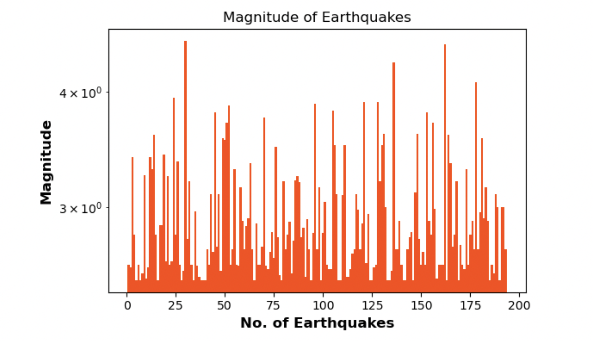
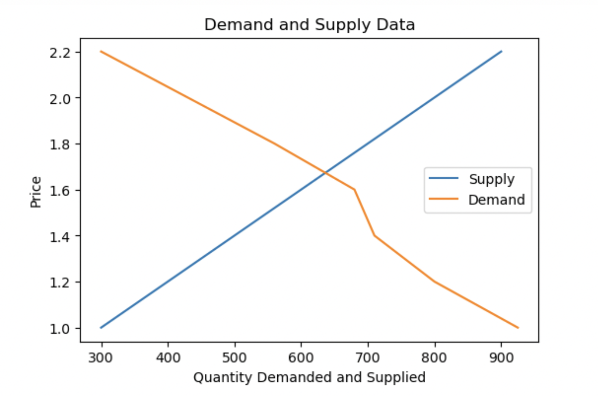
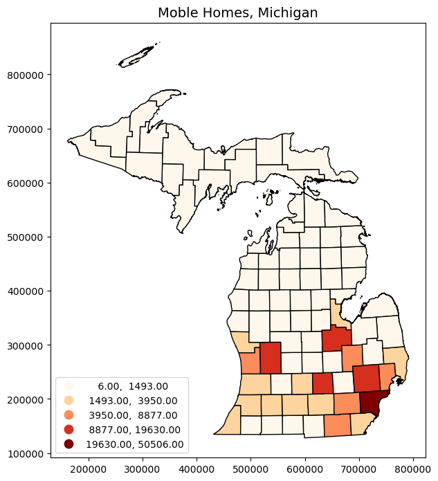
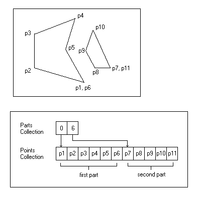
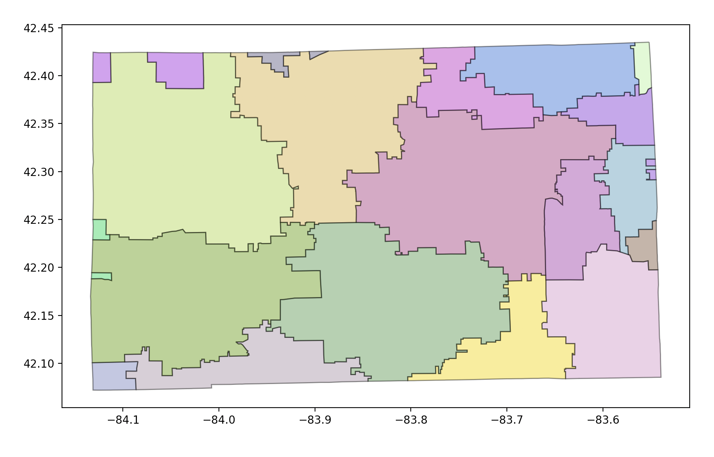
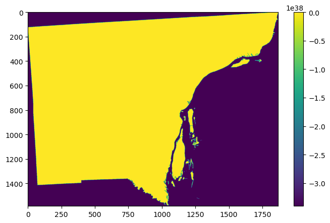

Reading and Displaying Files
================================

To read a file, we must first open the file. This is done using Python's built-in open() function. The open() function returns a file object, which has a read() method for reading  files and storing their contents as variables .  Once a file is read and stored as a variable, the original file can be closed.  We can then loop through the file variable and do stuff with its contents.

.. code-block:: python

	file = open("/Users/student/Desktop/Equakes2.csv", "r")
	text = file.readlines()
	file.close()

	for line in text:
	    print (line)

**Data**

* `Download Earthquake Data <https://corgis-edu.github.io/corgis/csv/earthquakes/>`_

* You can also download earthquake data from the `USGS website <https://earthquake.usgs.gov/earthquakes/search/>`_.

*Points to Note anout the Above Code*

1. The open method has the following modes:

  | ‘r’ – Python read file. Read mode is used when the file is only being read
  | ‘w’ – Python write file. Write mode is used to edit and write new information to the file (any existing files with the same name will be erased when this mode is activated)
  | ‘a’ – Python append file. Append mode is used to add new data to the end of the file; that is new information is automatically amended to the end
  | ‘r+’ – Special read and write mode is used to handle both actions when working with a file

2.  Always close the file after reading or writing to it. In most cases, upon termination of an application or script, a file will be closed eventually. However, there is no guarantee when exactly that will happen. This can lead to unwanted behavior including resource leaks and unwanted behavior.

|

Writing File Paths
--------------------

In Python, it is better not to write your file paths with backslashes as shown below:

.. code-block:: python

	file = open("C:\Users\student\Desktop\earthquakes.csv", "r")

Writing paths with backslashes is not advisable because a Python string can contain special characters that also incorporate backslashes for other reasons, e.g.,  "\t" (tabs),  "\n" (newlines), "\r" ( carriage returns), etc.

These special characters make it very hard to create a file path that uses single backslashes because file paths in Windows also use single backslashes. There are several workarounds:

**1. Use Forward Slashes**

.. code-block:: python

   file = open("C:/Users/student/Desktop/earthquakes.csv", "r")

|

**2. Use Raw Strings**

These are regular strings, but includes an r before the script begins.  The r tells the Python Interpreter that the string does not contain any special characters or escape characters.

.. code-block:: python

   file = (r"C:\Users\student\Desktop\earthquakes.csv")

|

**3. Use Double Backslahes**

In this case, the backslashes are escaped using a second backslash.

.. code-block:: python

   "C:\\Users\\student\\Desktop\\earthquakes.csv"

|

**4.  Use os.path.join**

The os module provides access to operating system functions regardless of the platform you are using, i.e, Windows, Mac OS, Linux, etc. 

os.path.join() takes any number of path strings and returns a single path using the platform-specific path separator.  

To create a string specifically for the Windows environnment, we can write the os.path.join() string as shown below.

.. code-block:: python

	import os
	os.path.join("c:/", "Windows")

	>>> 'c:/Windows'

To create a string for a platform regardless of whether it is Windows, Mac OS, Linux, etc., we can write the os.path.join() string as shown below. In this situation, the operating system will take care of the separator.

.. code-block:: python

	import os
	os.path.join('c:', os.sep, 'mydata')
	
	>>> 'c:\\mydata'

Note: os.sep will supply the separator

It is also possible to pass in the current working directory to os.path.join(), as shown in the script below.  

.. code-block:: python

	import os

	dem_path = os.path.join(os.getcwd(), 'Shasta-30m-DEM.tif')
	
	>>> dem_path

	>>> dem_path = '/Users/hsemple/Documents/python_gis_tutorials/docs/Shasta-30m-DEM.tif

|

Opening a file using the "With" Statement
------------------------------------------

A second way second way to open a file is to use the "with" statement.  The with statement automatically takes care of closing the file once it leaves the with block, even in cases of error. I highly recommend that you use the with statement as much as possible, as it allows for cleaner code and makes handling any unexpected errors easier for you.

.. code-block:: python

	with open("/Users/student/Desktop/Equakes2.csv", 'r') as file:
	   text = file.readlines()
	for line in text:
	   print (line)

|

Opening a csv File using Python's Standard Library
----------------------------------------------------

Let's open a csv data file using some basic Python statements. First, we will let Python read the file and create a file object. Next, we will split the file contents into inidividual columns, and then store the column data in variables. This is a long-winded way of displaying csv files, but 
the objective with this code sample is to illustrate some details that is involved in opening these files.  For regular work, we use libraries such as Pandas which it much easier to display the csv files. Pandas will be discussed shortly.

.. code-block:: python

	infile = open("/Users/student/Desktop/earthquakes.csv", 'r') 
	lines = infile.readlines() 
	infile.close() 

	del lines[0] # Remove the first line
	#Create empty lists 
	xvar = [] 
	yvar = []
	count = 0

	for line in lines:
	    elements = line.split(",") # splits the line
	    mag = float(elements[2]) # Get the data in the third column
	    dep = float(elements[3]) # Get the data in the fourth column

	    # Add magnitude and depth data to the empty lists 
	    xvar.append(dep) 
	    yvar.append(mag)

	#Format the two lists as columns separated with a space

	magnitude = "Magnitude"
	depth = "Depth"

	print ("%-15s %s" %(magnitude, depth))
	print ("")

	for c1, c2 in zip(xvar, yvar):
	    print ("%-15s %s" % (c1, c2))

.. image:: img/magnitude_depth.png
   :alt: Formatted Table

*Things to Look up in the above code*

a. `Formatting Output <https://python-course.eu/python-tutorial/formatted-output.php>`_
b. `Python Zip Function <https://www.programiz.com/python-programming/methods/built-in/zip>`_

|

**Performing Calculations and Making a Graph using Python's Standard Library**

.. code-block:: python

	import math
	import matplotlib.pyplot as plt
	infile = open("C:/Users/student/Desktop/earthquakes.csv, 'r')
	lines = infile.readlines()
	infile.close()
	del lines[0] # Remove the header line

	#Create empty lists
	xvar = []
	yvar = []
	std_dev = []
	count = 0
	sum = 0
	for line in lines:
	    elements = line.split(",") #splits the lines
	    mag = float(elements[4]) # Get the data in the fifth column
	    count = count + 1

	    # Add count and magnitude data to the empty x,y lists
	    xvar.append(count)
	    yvar.append(mag)
	    sum = sum + mag

#Calculate mean
average = sum / count

rint ("Average is", round(average,5))
print ("")

width = 1

fig, ax = plt.subplots(figsize=(6, 4))
ax.bar(xvar, yvar, width, color='orangered')
ax.set_yscale('log')  # Set y-axis to logarithmic scale
ax.set_xlabel("No. of Earthquakes", fontweight='bold', fontsize=12, color='black')
ax.set_ylabel("Magnitude", fontweight='bold', color='black', fontsize=12)
ax.set_title("Magnitude of Earthquakes")

plt.tight_layout()  # Adjust figure spacing
plt.show()

|

The Matplotlib Figure Object
--------------------------------

When working with Python, it is important to know how to manipulate matplotlib's figure object.  Almost all of your graphical output will require the use of this figure object either directly or indirectly. The links below provide some information on ths topic.

In terms of a general overview, in matplotlib's languge, the figure object is the top level object. It serves as the container for all other plot-related objects.   

The figure object can contain one or more axes or plotting objects. Axes are actual X,Y plots or diagrams that appear in the document.  Axes contain the X-axis and the Y-axis, which are the XY lines in the plots. Axes also have plot objects, titles, legends, etc.

The easiest way to create a new figure is to use the figure method of the matplotlib pyplot interface:

>>> f = plt.figure()  

If you want to control the figure size, you can use the figsize argument of the figure method. Figure size is given in width first then height (in inches)

 >>> f = plt.figure.figsize=(12,10) 
    

The above statements will create an empty figure object with no axes.  

Often, we encounter code samples, such as the one below, that do not specify any figure object.  If no figure object is specified in the code, then pyplot uses a default figure object to draw the figure. 

.. code-block:: python

	import matplotlib.pyplot as plt
	x = [0.3, 3.8, 1.2, 2.5]
	y = [11, 25, 9, 26]
	plt.scatter (x,y, color='darkgreen', marker='^')
	plt.xlim(0.5, 4.5)
	plt.show()

The main benefit of explicity specifying a figure is that you can control its size, background, color, etc.  In the code sample below, the size of the figure object is specified.

.. code-block:: python

	import matplotlib.pyplot as plt
	x = [0.3, 3.8, 1.2, 2.5]
	y = [11, 25, 9, 26]

	fig = plt.figure(figsize=(4,6))
	plt.scatter (x,y, color='darkgreen', marker='^')
	plt.xlim(0.5, 4.5)
	plt.show()

|

**Subplots**

Within a figure, there can be one or more "subplots".   Subplots are objects within a figure that divide up the figure. The subplots are positioned in a grid so that 221, means 2 rows, 2 columns, and the first cell. 

.. image:: img/subplot1.png
   :alt: Subplots

The code below includes a figure and a subplots.  Note that when a subplot is created, it is referred to as an axes. That's because it is also the plotting area for the figure. Also, unused axes are not shown.

.. code-block:: python

	import matplotlib.pyplot as plt
	x = [0.3, 3.8, 1.2, 2.5]
	y = [11, 25, 9, 26]

	fig = plt.figure(figsize=(4,6))
	ax = fig.add_subplot(221)
	plt.scatter (x,y, color='darkgreen', marker='^')
	plt.xlim(0.5, 4.5)
	plt.show() 
	

.. image:: img/subplots_2x2.png
   :alt: Subplots

|

**Axes**

An axes is the area on which the data is plotted using functions such as plot() and scatter().  Axes can have ticks, labels, etc, associated with it. 

As shown in the previous section, axes can be created from a figure object  
             ax = fig.add_subplot(111)

Axes can also be created directly from pyplot:
             ax = plt.subplot(221)

.. image:: img/matplotlib_figure_object.png
   :alt: Subplots

|

Once the axes is created, it can be used to plot various types of charts or to plot images and maps. For example, to plot various types of charts, we write:

| ax.bar  - bar charts
| ax.hist  - histograms
| ax.scatter - scatter plot
| ax.imshow. - images
| etc

When plotting graphs, charts, and images, if no axes is specified in the code, you can still use the pyplot module to plot the objects.  

| plt.bar  - bar charts
| ply.hist  - histograms
| plt.scatter - scatter plot
| plt.imshow. - images

|

**Plotting Multiple Axes on a Single Figure**

A single figure can contain multiple axes, each of which can contain separate plots.

.. code-block:: python

	import matplotlib.pyplot as plt
	import geopandas as gpd

	file = "/Users/.../school_districts.shp" 

	df = gpd.read_file(file)

	ax1 = plt.subplot(221)
	df.plot(ax=ax1, edgecolor="black")

	ax2 = plt.subplot(222)
	df.plot(ax=ax2, edgecolor="black")

	ax3 = plt.subplot(223)
	df.plot(ax=ax3)

	plt.show()

.. image:: img/subplots221.png
   :alt: Subplots

|

**Setting Legend**

To set the legend for an axes, simply type:  ax.legend()

.. code-block:: python
	
	import matplotlib.pyplot as plt

	fig = plt.figure(figsize=(6,4))
	ax = fig.add_subplot(111)

	ax.plot([300, 400,500,600,700,800,900], 
	        [1.00, 1.20, 1.40, 1.60, 1.80, 2.00, 2.20], label = 'Supply')

	ax.plot([300, 430,560,680,710,800,925],
	        [2.20, 2.00,1.80, 1.60,1.40,1.20,1.00], label = 'Demand')

	ax. set_ylabel('Price')
	ax. set_xlabel('Quantity Demanded and Supplied')
	ax.set_title("Demand and Supply Data")
	ax.legend()
	plt.show

For more information on how to use the matplotlib figure object, please click on the links below:

* `Anatomy of a Matplotlib Figure <https://matplotlib.org/2.0.2/faq/usage_faq.html>`_ 

* `Pyplot Tutorial <https://matplotlib.org/stable/tutorials/introductory/pyplot.html>`_

|

|

Reading CSV Files Using Pandas
-----------------------------------

The script above used many lines of code to open the csv file, compute average, and plot a graph.  We can achieve the same results with far fewer lines of code by using a specialized library named Pandas.  Pandas is a very powerful, popular and easy to use Python library for data analysis.  It has many Excel-like functions. Its primary object is the DataFrame, which can be thought of as an abstract database table or spreadsheet.  Once you create a dataframe object, you can use it to display tables, plot columns, create and run queries, with just a few lines of code. 

 
Let's plot the earthquake dataset using Pandas. 

.. code-block:: python

	import pandas as pd
	df = pd.read_csv("../earthquakes.csv")
	df

|

**Displaying Specific Columns of your Dataframe**

To select multiple columns, use a list of column names within the selection brackets [].  In the example below, we are selecting the earthquake depth and magnitude fields. 

.. code-block:: python
 
	import pandas as pd
	df = pd.read_csv("../earthquakes.csv")
	df[['depth', 'magnitude']]

|

Get the size of the table.

.. code-block:: python

	import pandas as pd
	df = pd.read_csv("../earthquakes.csv")
	df[["depth", "mag"]].shape

|

**Filtering the Data Frame for Certain Rows**

.. code-block:: python

   import pandas as pd
   df = pd.read_csv("../earthquakes.csv")
   above_3.5 = df[["mag"] > 3.5]
   above_35.head()

|

Plotting Graphs
-----------------

Many types of graphs can be plotted by pandas. Below are seven types of graphs that are useful to know how to create.

The kind parameter accepts eleven different string values and determines which kind of plot you’ll create:

   | "area" is for area plots.
   | "bar" is for vertical bar charts.
   | "barh" is for horizontal bar charts.
   | "box" is for box plots.
   | "hexbin" is for hexbin plots.
   | "hist" is for histograms.
   | "kde" is for kernel density estimate charts.
   | "density" is an alias for "kde".
   | "line" is for line graphs.
   | "pie" is for pie charts.
   | "scatter" is for scatter plots.

|

**Line Graph**

.. code-block:: python

	import matplotlib.pyplot as plt
	import pandas as pd

	df = pd.read_csv("../earthquakes.csv")
	df.plot(kind='line',y='depth',color='red', figsize=(6, 8))
	plt.show()

|

**Histogram**

.. code-block:: python

	import matplotlib.pyplot as plt
	import pandas as pd
	df = pd.read_csv("../earthquakes.csv")

	#df.plot.line(column = df.columns[3],  figsize=(6, 8))

	df.plot(kind='hist',y='Depth_mls',color='red',bins = 10, figsize=(6, 8))
	plt.show()

|

**Bar Plot**

.. code-block:: python

   import matplotlib.pyplot as plt
   import pandas as pd

   speed = [0.1, 17.5, 40, 48, 52, 69, 88]
   lifespan = [2, 8, 70, 1.5, 25, 12, 28]
   index = ['snail', 'pig', 'elephant','rabbit', 'giraffe', 'coyote', 'horse']

   df = pd.DataFrame({'speed': speed,'lifespan': lifespan}, index=index)

   ax = df.plot.bar(rot=10)
   plt.title("Speed vs Lifespan, Selected Animals")
   plt.show()

|

**Scatterplot**

To plot the Depth and Magnitude Data as a scatterplot, write:

.. code-block:: python

	import matplotlib.pyplot as plt
	import pandas as pd
	df = pd.read_csv("/Users/.../earthquakes.csv")

	df.plot(kind='scatter', x='depth',y='magnitude', color='red',figsize=(6, 8))
	plt.show()

or

.. code-block:: python

	df.plot(kind='scatter',x='Depth_mls',y='Magnitude',color='red')

	plt.show()

|

|

*Notes:*

* ax is the axes on which to draw the map
* cmap is the name of the `colormap <https://matplotlib.org/stable/tutorials/colors/colormaps.html>`_
* legend & legend_kwds control the display of the legend.

|

Writing to a File
--------------------

Once we are done with data analysis, we can also write to a file, as shown below.

.. code-block:: python

	with open("C:/Users/.../john.txt", "w") as f:
	    f.write('Hello \n')
	    f.write('Hello \n')
	    f.write('Hello \n')
	    f.write('Hello \n')
	    f.write('Hello \n')
	    f.write('Hello \n')
	    f.write('Hello \n')
	f.close

|

Reading a Data file into Python, splitting its contents by columns, and storing the columns in variables

.. code-block:: python
 
	infile = open("C:/Users/.../earthquakes.csv, 'r') 
	lines = infile.readlines() 
	newfile=open("../newfile.txt",mode="a+",encoding="utf-8")

	del lines[0] # Remove the first line
	#Create empty lists 
	xvar  = [] 
	yvar  = []
	count = 0
	sum   = 0

	for line in lines:
	     elements = line.split(",") # splits the line
	     mag = float(elements[4]) # Get the data in the fifth column 
	     count = count + 1

	     # Add count and magnitude data to the empty x,y lists 
	     xvar.append(count) 
	     yvar.append(mag)
	     sum = sum + mag
	     newfile.write("\n")
	     newfile.write(str(mag))

	#Calculate mean
	average = sum / count
	newfile2.write(str(average))
	infile.close()
	print ("The average earthquake magnitude is",round(average, 2))
	print ("")

|

Plotting Shapefiles
--------------------

There are many libraries available for plotting shapefiles. Such libraries include Geopandas, Shapely, Fiona, OGR, and descartes. Altogether, one of the main contributions of these libraries is that we no longer have to rely on GIS software to view shapefiles and their attribute data. This can be done easily with Python. 

Among the various libraries, Geopandas is perhaps the most widely used for plotting shapefiles as it only requires a few lines of code to display the shapefile. Also, attribute tables can be easily manipulated as a panda/geopanda dataframes.  

The other libraries are also important depending on the task that you would like to perform.  Since geopandas hides almost all its implementation, you will find that studying the code of other libaries gives you a clearer picture of how to handle shapefiles from a Python perspective. 

|

**Displaying Shapefiles using Geopandas**

To use Geopandas, first, download and install the `library <'https://geopandas.org/en/stable/getting_started/install.html'>`_.  Afterwards, import the library and use it in your code.  

As an example, run the code below in your favorite development environment.  Note that the code draws the shapefile with a single color because no specific column is being plotted.

.. code-block:: python

   import geopandas as gpd
   import matplotlib.pyplot as plt

   geo_df = gpd.read_file ("/Users/../Michigan.shp")
   geo_df.plot()

.. image:: img/michigan_single_color.png
   :alt: Michigan Map

|

**Viewing the Shapefile's Attribute Table using Geopandas**

To view the attribute table of a shapefile, wit the Geopandas library,  use the head() method of the data frame object.

.. code-block:: python

   import geopandas
   import matplotlib.pyplot as plt
   gdf = geopandas("/Users/../Michigan.shp")

   #Show data in the attribute table
   print(gdf.head())

   #Display the shapefile
   f, ax = plt.subplots(1, figsize=(8, 11))

   gdf.plot(ax = ax, edgecolor='black')

   ax.set_title("Water Wells, Washtenaw County, Michigan", fontdict={'fontsize': '14', 'fontweight' : '3'})

   plt.show()

.. image:: img/michigan_attribute_table.png
   :alt: Michigan Map

|

**Creating a Graduated Color Thematic Map using Geopandas**

Often in GIS, we are interested in creating graduated color thematic maps based on specific columns. To do, simply enter parameters in the gpd.plot() method, as shown below.

*gdf.plot(ax = ax, column= 'HISPANIC', cmap='OrRd' , scheme='fisher_jenks', legend=True, edgecolor='black')*

.. code-block:: python

   import geopandas
   import matplotlib.pyplot as plt
   gdf = geopandas.read_file("../Michigan.shp")

   #Display the shapefile
   f, ax = plt.subplots(1, figsize=(10, 13))

   gdf.plot(ax = ax, column= 'HISPANIC', cmap='OrRd' , scheme='fisher_jenks', legend=True, edgecolor='black', legend_kwds={'loc': 'lower left'})

   ax.set_title("Mobile Homes, Michigan", fontdict={'fontsize': '14', 'fontweight' : '1'})

   plt.show()

   #Save the map
   f.savefig("/Users/.../map_export.png", dpi=300)

See the `Geopandas User Guide <https://geopandas.org/en/stable/docs/user_guide/mapping.html>`_ for more information.

|

**Plotting World Population Using Data Provided by Geopandas**

.. code-block:: python

	import geopandas as gpd

	df_world = gpd.read_file(gpd.datasets.get_path('naturalearth_lowres'))

	print (df_world.head())

	fig, ax = plt.subplots(1, 1, figsize=(16, 12))

	df_world.plot(column='pop_est', cmap='OrRd', ax = ax, ec="black",
	                     legend=True, legend_kwds={"label": "Population", "orientation":"horizontal"})
	ax.set_title("Countries of the World by Population")

.. image:: img/world_population.png
   :alt: Thematic Map

|

Displaying Shapefiles Using Fiona
-----------------------------------

Fiona is a low-level library that focuses on reading and writing geospatial data formats. It acts as a Pythonic interface to the OGR library, providing direct access to the capabilities of OGR for working with vector data. Fiona is known for its efficiency, simplicity, and interoperability with various geospatial file formats. It is often used when specific data access or format-related functionalities are required.

.. code-block:: python

	import fiona
	import matplotlib.pyplot as plt
	from shapely.geometry import shape

	# Path to the shapefile
	shapefile_path = '/Users/.../cities.shp'

	# Open the shapefile using Fiona
	with fiona.open(shapefile_path, 'r') as shp:
	    # Create a new figure
	    plt.figure(figsize=(10, 10))

	    # Iterate over each feature in the shapefile
	    
	    if geometry is not None:
	        
	        for feature in shp:
	            geometry = shape(feature['geometry'])
	            properties = feature['properties']

	            # Check the type of geometry
	            if geometry.geom_type == 'Point':
	                # Handle points
	                plt.plot(geometry.x, geometry.y, 'ro')
	                # Add label
	                plt.text(geometry.x, geometry.y, properties['NAME'], fontsize=8, ha='center', va='bottom')
	            elif geometry.geom_type == 'LineString':
	                # Handle lines
	                plt.plot(*geometry.xy, 'b-')
	                # Add label
	                centroid = geometry.centroid
	                plt.text(centroid.x, centroid.y, properties['NAME'], fontsize=8, ha='center', va='bottom')
	            elif geometry.geom_type == 'Polygon':
	                # Handle polygons
	                plt.plot(*geometry.exterior.xy, 'g-')
	                for interior in geometry.interiors:
	                    plt.plot(*interior.xy, 'g--')
	                # Add label
	                centroid = geometry.centroid
	                plt.text(centroid.x, centroid.y, properties['NAME'], fontsize=8, ha='center', va='bottom')

	        # Set the plot limits and labels
	        plt.xlabel('Longitude')
	        plt.ylabel('Latitude')
	        plt.title('Shapefile Visualization')
	        plt.grid(True)

	        # Show the plot
	        plt.show()

|

*Notes:*

* ax is the axes on which to draw the map
* cmap is the name of the `colormap <https://matplotlib.org/stable/tutorials/colors/colormaps.html>`_
* legend & legend_kwds control the display of the legend.

|

**Displaying a Shapefile Using PyShp**

Pyshp is an open source library that can be used to display a shapefile using pure Python. The project is described at this `website <"https://pypi.org/project/pyshp/">`_.  PyShp code for displaying a shapefile is lengthier than the one used by geopandas, but it gives us an opportunity to learn about multipart polygons and polylines.   Please note that after installing the "Pyshp" library, it is imported into Python using the shapefile keyword, e.g., "import shapefile".   

Prior to running the code,it is useful to know that shapefiles have a 'parts collection' and a 'points collection'.  A parts collection is used to keep track of the number of polygons or line segments associated with each record.  This is required because in many situations, more than one polygons or polylines must be linked to a record in the attribute table.  As an example, since Hawaii is made up of several islands, multiple polygons are needed to represent each island in the state. However in the attribute table, only a single record is used to represent the state. 

In a shapefile, a record with one polygon will have one part, but this will show in the parts collection as 0 because the counting system begins with zero. 

A points collection refers to the list of points associated with a shape or feature. When working with points collection, be aware that the x-coordinates have an index of [0] while the y-coordinates will have an index value of [1].  The index values allow us to retrieve the x and y coordinates as separate lists.

The illustration below shows how we visualize the relationships between a parts collection and a points collection.  The upper section of the illustration shows the polygons associated with a single record while the lower section shows the part and points collection associated with the polygons.  Since there are two polygons associated with the record, the parts collection for that record is 1 because the count starts from zero.

The values in the squares in the parts collection represent index numbers that keep track of the starting coordinates for each part. Thus, the first part has coordinates that go from from p1 to p6. The second part starts from index value 6, and has coordinates that go from p7 to p11.

Using Pyshp we can experiment with displaying a shapefile using only its points collection and with both its parts and points collection. The code below shows how to display a shapefile using only its points collection.   

.. code-block:: python

   import matplotlib.pyplot as plt 
   import shapefile 
   sf = shapefile.Reader("Users/../Michigan.shp")

   plt.figure(figsize=(7,8)) 
   for each_rec in sf.shapeRecords(): 
	   x = [i[0] for i in each_rec.shape.points] 
	   y = [i[1] for i in each_rec.shape.points]
	   plt.plot(x,y, color="gray")

   plt.show()

|

The code below plots a Michigan shapefile using both the parts and points collection.  This is a much better way to plot the shapefile. To display the parts and points of a shapefile, the code must first get the number of parts associated with each polyline or polygon, then loop through each part to get the array of points for the part. 

.. code-block:: python

	import shapefile as shp
	import matplotlib.pyplot as plt

	sf = shp.Reader("Users/../Michigan.shp")

	plt.figure(figsize = (7,8))

	# loop through each record in the shaperecords collection 
	for each_rec in sf.shapeRecords():
	    for i in range(len(each_rec.shape.parts)):   
	        i_start = each_rec.shape.parts[i]   #Get the starting values for the part.
	        if i==len(each_rec.shape.parts)-1: 
	            i_end = len(each_rec.shape.points)  #Get the length of the points collection.
	        else:
	            i_end = each_rec.shape.parts[i+1]  

	        #Get the X,Y coord of the points in each part and make a list
	        x = [i[0] for i in each_rec.shape.points[i_start:i_end]]
	        y = [i[1] for i in each_rec.shape.points[i_start:i_end]]
	        plt.plot(x,y, color = "green")
	        
	plt.show()

|

**Displaying Single or Multi-Polygon Shapefiles using Descartes**

The Descartes library is another alternative for displaying shapefiles using Python.  Descartes uses geometric objects as input for displaying `matplotlib paths and patches as lines and polygons <https://matplotlib.org/stable/api/pyplot_summary.html>`_.   Experiment with the code below to learn about `geo_interfaces <https://gist.github.com/sgillies/2217756>`_ from the shapefile library,  add_patch() from matplotlib, and PolyPatch () from Descartes.

.. code-block:: python
   
   import shapefile as shp
   import matplotlib.pyplot as plt
   from descartes import PolygonPatch

   sf = shp.Reader("../School_Districts.shp")
   fig = plt.figure()

   ax = fig.gca()

   for poly in sf.shapes():
	   poly_geo=poly.__geo_interface__
	   ax.add_patch(PolygonPatch(poly_geo, fc='#6699cc', ec='#000000', alpha=0.5, zorder=2 ))

	ax.axis('scaled')
	plt.show()

.. image:: img/school_districts_descartes.png
   :alt:  Shapefile Displayed with Descartes

	

|

In this example, the code above has been modified to display the polygons in the shapefile with multiple colors.

.. code-block:: python

   import shapefile as shp
   import matplotlib.pyplot as plt
   from descartes import PolygonPatch
   import random

   sf = shp.Reader("/Users/.../school_districts.shp")
   fig = plt.figure()

   ax = fig.gca()

   for poly in sf.shapes():
	   poly_geo=poly.__geo_interface__

	   # Generate a random number between 0 and 2^24
	   color = random.randrange(0, 2**24)

	   # Convert the number from base-10 (decimal) to base-16 (hexadecimal)
	   hex_color = hex(color)

	   std_color = "#" + hex_color[2:]

	   ax.add_patch(PolygonPatch(poly_geo, fc= str(std_color), ec='#000000', alpha=0.5, zorder=2 ))

  ax.axis('scaled')
  plt.show()

|

**Displaying a List of XY Coordinates as Points**

.. code-block:: python

	# import libraries
	import pandas as pd # Pandas  Read csv file 
	from shapely.geometry import Point #  Shapely for converting latitude/longtitude to geometry
	import geopandas as gpd # Geopandas for visualing shapefile 
	import matplotlib.pyplot as plt

	homicides = pd.read_csv('/Users/.../Toronto_Homicides.csv') 
	#print (homicides.head())
	#Download data at - https://data.torontopolice.on.ca/datasets/TorontoPS::homicides-open-data-asr-rc-tbl-002/explore

	# creating a geometry column
	geometry = [Point(xy) for xy in zip(homicides['X'], homicides['Y'])]

	# Coordinate reference system : WGS84
	crs = {'init': 'epsg:4326'}

	# Creating a Geographic data frame
	gdf = gpd.GeoDataFrame(homicides, geometry=geometry)

	# Plot all points
	gdf.plot(marker='o', color='r', markersize=1.5)

	plt.show()

   

.. image:: img/toronto_homicides.png
   :alt:  Toronto Homicides

|

The above task can be done entirely in geopandas using a script such as the one below:

.. code-block:: python

	import pandas as pd
	import geopandas as gpd

	homicide_data = pd.read_csv('/Users/.../Toronto_Homicides2.csv')

	homicide_gpd = gpd.GeoDataFrame(homicide_data, geometry = gpd.points_from_xy(homicides_data["X"],homicides_data["Y"] ))

	#homicide_gpd

	homicide_gpd.plot(markersize = 1.5, color = "red", figsize =(10,10))

Please view the video below for an explanation of the code.

.. raw:: html

    <iframe width="560" height="315" src="https://www.youtube.com/embed/aVkdWSqKG_c" title="YouTube video player" frameborder="0" allow="accelerometer; autoplay; clipboard-write; encrypted-media; gyroscope; picture-in-picture; web-share" allowfullscreen></iframe>

|

|

Displaying Rasters
--------------------

In programming, rasters are considered as *arrays*.  An array is a collection of items of the same data type that can be manipulated as a single entity.  In Python,  a list is a one dimensional array.  However, when we are thinking about rasters, we are typically thinking of two dimensional arrays that are defined by rows and columns.  

In Python, one difference between a list and a two-dimensional array is that whereas a list can store multiple data types, a two-dimensional array can store only one data type.  

.. image:: img/arrays1.png
   :alt: One and Two Dimensional Arrays

Python has specialized libraries for manipulating arrays. Two popular ones are the "numpy" library and the “array" module. Numpy appears to be more popular.  To import Numpy into your script, type:    

>>> import numpy as np

The "np" is a nickname by convention. To learn more about arrays, please click on `this link <https://jakevdp.github.io/PythonDataScienceHandbook/02.02-the-basics-of-numpy-arrays.html>`_.

|

**Displaying a DEM using GDAL and Matplotlib** 

One way to display a raster is to open the raster file using the gdal library, then convert the raster into an array using GDAL. Afterwards, we can use matplotlib's pyplot.imshow() to display the array.    If you not familiar with imshow, please look it up. Imshow takes a 'vmin' argument which sets the minimum display values. In this case elevation values of zero and higher will be displayed.  Thus, if the raster has a negative nodata value, it will bot be displayed.  Cmap is a color map. Here we are using the matplotlib's `color map  <https://matplotlib.org/stable/tutorials/colors/colormaps.html>`_ named "gist_earth".

.. code-block:: python

   import gdal
   import matplotlib.pyplot as plt

   #Open raster and read number of rows, columns and bands
   ds = gdal.Open("/Users/.../topography/dem")

   band1 = ds.GetRasterBand(1)

   raster_array = band1.ReadAsArray()
   plt.imshow(raster_array,vmin=0, cmap="gist_earth")
   plt.show()

.. image:: img/wayne_dem2.png
   :alt: Wayne DEM

|

In the illustration above, the raster is displayed without any reference to real world coordinates.  The coordinates displayed are just counts of the raster cells.  

In GIS, it is typical for map layers to be displayed with their real world coordinates. In the sample script below, the geotransform function is introduced.  This function is used to recalibrate the cell values in terms of real world coordinates. The script also introduces raster legends.

The GeoTransform contains a tuple of values that are used to establish the coordinates of the upper left (UL) corner of a raster.  GeoTransform basically takes these values and use them to renumber the entire image in terms of the real world coordinate values. There are six values in the geotransform tuple. They are shown below.

| GeoTransform[0]  - he upper left xcoordinate
| GeoTransform[1]  - west-east pixel resolution
| GeoTransform[2]  - rotation, 0 if image is north up.
| GeoTransform[3]  - the upper left y coordinate
| GeoTransform[4]  - rotation, 0 if image is north up.
| GeoTransform[5]  - north-south pixel resolution

|

In the script below, ulx and uly are the coordinates in the the upper left corner in the GeoTranformed raster while lrx and lry are the coordinates in the lower right corner.

.. code-block:: python

	import gdal
	import matplotlib.pyplot as plt
	import matplotlib.colors as colors

	#Set directory
	ds = gdal.Open('/Users/.../topography/dem')
	if ds is None:
	    print ('Could not open file')
	    sys.exit(1)

	band1 = ds.GetRasterBand(1)
	no_data = band1.GetNoDataValue()
	raster_array = band1.ReadAsArray()

	ulx,xres,xskew,uly,yskew,yres = ds.GetGeoTransform()
	lrx = ulx + (ds.RasterXSize * xres)
	lry = uly + (ds.RasterYSize * yres)
	print (ulx,lrx,lry,uly)

	fig, ax = plt.subplots(figsize=(8, 5))

	#Array contains many no data values, therefore normalize legend from 0 to 1.
	norm = colors.Normalize(vmin = 0, vmax = raster_array.max())

	cmap = plt.get_cmap("gist_earth")
	img = plt.imshow(raster_array, cmap, norm, extent=(ulx, lrx,lry,uly)) # Get the plot renderer object.
	cbar = plt.colorbar(img,shrink=0.75) #Associate the color bar with the plot renderer and axes objects.
	cbar.set_label('Meters')

	plt.savefig('dem_plot.png', dpi=300, bbox_inches='tight')
	plt.show()

.. image:: img/wayne_dem_gdal.png
   :alt: Wayne DEM

*References*

Raster data processing with Python and GDAL -
https://notebook.community/Automating-GIS-processes/Lesson-7-Automating-Raster-Data-Processing/Python-and-Gdal

Introduction to NumPy and OpenCV.
http://vision.deis.unibo.it/~smatt/DIDATTICA/Sistemi_Digitali_M/PDF/Introduction_to_NumPy_and_OpenCV.pdf

|

**Displaying a Raster using Rasterio and Matplotlib**

Rasterio is a popular open source Python library used for viewing and manipulating rasters.  Rasterio utilizes the gdal library to display rasters. With rasterio, viewing a raster can be done with just a few lines of code, like the example below. 

Rasterio has a show( ) method for displaying rasters. However, the library also uses pyplot’s imshow method to display the data.

.. code-block:: python

   import rasterio
   from matplotlib import pyplot

   src = rasterio.open("/Users/.../topography/dem")

   # Get the bounding box coordinates of the raster
   extent=[src.bounds[0], src.bounds[2], src.bounds[1], src.bounds[3]] 
   
   #Convert the raster into an array
   src_array = src.read(1)

   fig, ax = pyplot.subplots(1, figsize=(8, 5))

   # Get the plot renderer object.
   img = ax.imshow(src_array, cmap=plt.get_cmap('jet'), extent=extent, norm = colors.Normalize(vmin = 0, vmax = src_array.max()))  

   ax.set_title("Digital Elevation Model, Wayne County")

   #Associate the figure object with plot renderer and axes objects.
   fig.colorbar(img, ax=ax) 

   #Let the axes object set the length of the colobar. 
   ax.set_aspect('auto') 

   pyplot.show()

`Source <https://shakasom.medium.com/how-to-convert-latitude-longtitude-columns-in-csv-to-geometry-column-using-python-4219d2106dea>`_

|

**Displaying a three-band Aerial Photo with GDAL**

.. code-block:: python

  import numpy as np
  from osgeo import gdal
  import matplotlib.pyplot as plt

  aerial = gdal.Open("/Users/semple/Desktop/Detroit.png
    

  bnd1 = aerial.GetRasterBand(1)
  bnd2 = aerial.GetRasterBand(2)
  bnd3 = aerial.GetRasterBand(3)

  #Now turn each band into a ndarray:
  img1 = bnd1.ReadAsArray()
  img2 = bnd2.ReadAsArray()
  img3 = bnd3.ReadAsArray()    

  #Then stack them to have a 3 band image
  img = np.dstack((img1,img2,img3))

  plt.imshow(img)    
  plt.show()

|

**Displaying Satellite Imagery with GDAL**

.. code-block:: python

   import numpy as np
   from osgeo import gdal
   import matplotlib.pyplot as plt

   
   #Image-2019
   band5 = "/Users/.../Landsat/LT05_L1TP_019031_20111106_20160830_01_T1_B5.TIF"
   band4 = "/Users/.../Landsat/LT05_L1TP_019031_20111106_20160830_01_T1_B4.TIF"
   band3 = "/Users/.../Landsat/LT05_L1TP_019031_20111106_20160830_01_T1_B3.TIF"
 

   #Open the Landsat image bands with GDAL

   B5_data = gdal.Open(band5)
   B4_data= gdal.Open(band4)
   B3_data = gdal.Open(band3)

   B5_Array  = B5_data.GetRasterBand(1).ReadAsArray().astype(np.float32)
   B4_Array = B4_data.GetRasterBand(1).ReadAsArray().astype(np.float32)
   B3_Array = B5_data.GetRasterBand(1).ReadAsArray().astype(np.float32)

   #Then stack them to have a 3 band image
   img = np.dstack((B5_Array,B4_Array,B3_Array))

   plt.imshow(img)    
   plt.show()

|

|

**Displaying a Three-band Raster with Rasterio**

Rasterio is a popular open source Python library used for viewing and manipulating rasters.  Rasterio utilizes the gdal library to display rasters. With rasterio, viewing a raster can be done with just a few lines of code, like the example below. 

Rasterio has a show( ) method for displaying rasters. However, the library can also use pyplot’s imshow method to display the data. The example below uses the show method.

.. code-block:: python

  import rasterio
  from rasterio.plot import show
  src = rasterio.open("/Users/.../Detroit.png")

  show(src)

|

**Displaying a Raster in QGIS Using Python**

.. raw:: html

    <iframe width="560" height="315" src="https://www.youtube.com/embed/W5_3H2UWYms" title="YouTube video player" frameborder="0" allow="accelerometer; autoplay; clipboard-write; encrypted-media; gyroscope; picture-in-picture; web-share" allowfullscreen></iframe>

|

|

**Displaying Web Maps and Feature Layers Stored in ArcGIS Online Using ArcGIS API for Python**

*Making an Anonymous Connection to ArcGIS Online*

The code sample code below lets you connect anonymously to Arcgis Online and search for content that are related to 'Michigan' and that are publicly available.

.. code-block:: python

   from arcgis.gis import GIS
	gis = GIS()  # Connect to ArcGIS Online as an anonymous user
	search_subset = gis.content.search("Michigan", max_items=100)
	search_subset

The results should be similar to the illustration below.

.. image:: img/search_arcgisonline.png
   :alt: Search Arcgisonline 

Now, let's search for a particular layer named "BA Web App Suitability Analysis Data"

.. code-block:: python

	from arcgis.gis import GIS
	gis = GIS()  # Connect to ArcGIS Online as an anonymous user
	search_subset = gis.content.search("BA Web App Suitability Analysis Data")
	search_subset

The result is:

[<Item title:"Justice40 Tracts Map April 2022" type:Web Map owner:esri_demographics>,
 <Item title:"Justice40 Tracts Map May 2022" type:Web Map owner:esri_demographics>,
 <Item title:"Live Fire Web App (Hosted by Paul Doherty) " type:Web Mapping Application owner:pjdohertygis>,
 <Item title:"10 Minute Drive Access to Grocery Stores" type:Map Image Layer owner:UOdocent>,
 <Item title:"10 Minute Walk Access to Grocery Stores" type:Map Image Layer owner:UOdocent>,
 <Item title:"BA Web App Suitability Analysis Data" type:Web Mapping Application owner:bpeverall22@COAGIS>, 

Let's get the first item from the list.

.. code-block:: python

	from arcgis.gis import GIS
	gis = GIS()  # Connect to ArcGIS Online as an anonymous user
	search_subset = gis.content.search("BA Web App Suitability Analysis Data")
	subset_item = search_subset[0]
	subset_item

.. image:: img/Justice40Tracts.png
   :alt: Search Arcgisonline 

*Connect to your ArcGIS Online Account*

Let's log into our own ArcGIS Online Account and display some of the content. The general syntax is shown below.  Notice that we are passing in the URL of the ArcGIS Online server (or portal), our username, and password to "GIS".

.. code-block:: python

	import arcgis
	from arcgis.gis import GIS

	#connect to your GIS
	gis = GIS("https://www.arcgis.com","username","password")
	my_content = gis.content.search(query="owner:" + gis.users.me.username, max_items=100)
	my_content

|

*Connect to a Feature Layer*

.. code-block:: python

	# Establish a connection to your GIS.
	from arcgis.gis import GIS
	from IPython.display import display
	gis = GIS("https://www.arcgis.com","username","password")

	# Search for 'USA major cities' feature layer collection
	search_results = gis.content.search('title: USA Major Cities',
	                                    'Feature Layer')

	# Access the first Item that's returned
	major_cities_item = search_results[0]

	major_cities_item

|

*Connect to a Feature Layer using the Feature's ItemID*

.. code-block:: python

	from arcgis.gis import GIS
	from IPython.display import display
	gis = GIS() # anonymous connection to www.arcgis.com

	freeways = gis.content.get('91c6a5f6410b4991ab0db1d7c26daacb')
	freeways

.. image:: img/USAFreewaySystem.png
   :alt: Search Arcgisonline 

For more information, please visit the link below:

https://developers.arcgis.com/python/guide/working-with-feature-layers-and-features/

|
|

Exercises
-----------

1. Visit `this NFL website <https://nextgenstats.nfl.com/stats/passing#max-completed-air-distance>`_ and copy the quarter back data. Paste the data into Excel and save it in CSV format.  Use the standard library in Python or pandas to plot a simple histogram and boxplot of the data in the passing attempts field (ATT).   Also, calculate the mean and standard deviation of passing attempts.   Explain what your data is portraying in short paragraph.

2. Using Geopandas, create a thematic map for the USA or `Michigan <https://www.michigan.gov/coronavirus/stats>`_ showing the distribution of Covid19 cases across the country or state for the date for which you have data.  Write comments to explain what your code is doing.   Repeat the process using another Python library of your choice.

3. Extend the sample code in this Module that uses Descartes to display shapefiles in which the polygons are labeled.

4. Complete the `tutorial on this website <"https://blog.matthewgove.com/2021/06/18/the-ultimate-in-python-data-processing-how-to-create-maps-and-graphs-from-a-single-shapefile/">`_ including the challenge task at the end. 

5. Review `the tutorial on this page <https://pynative.com/python-matplotlib-exercise/>`_ and be prepared to discuss the code, particularly how Matplotlib is how used.

6. Modify the ArcGIS API for Python code above to enable you to log into your own ArcGIS Online account and display a web map.

|

Resources
-----------

* https://automating-gis-processes.github.io/CSC18/index.html
* Python Shapefile Library - https://pythonhosted.org/Python%20Shapefile%20Library/
* Land Cover Change Analysis with Python and GDAL - Tutorial - https://hatarilabs.com/ih-en/land-cover-change-analysis-with-python-and-gdal-tutorial
* Rasterio - https://geobgu.xyz/py/rasterio.html#
* Create Random Hex Color Code Using Python - https://www.geeksforgeeks.org/create-random-hex-color-code-using-python/#
* Plotting large shapefiles with matplotlib - https://gis.stackexchange.com/questions/202839/plotting-large-shapefiles-with-matplotlib/266675#266675
* ArcGIS API for Python. Working with web maps and web scenes - https://developers.arcgis.com/python/guide/working-with-web-maps-and-web-scenes/

|

