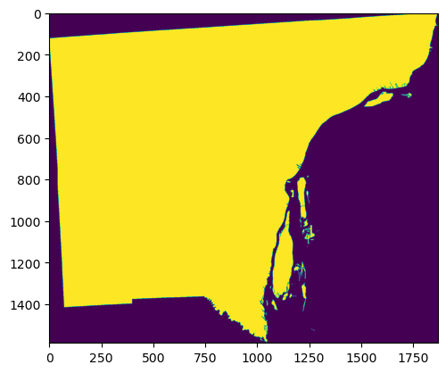
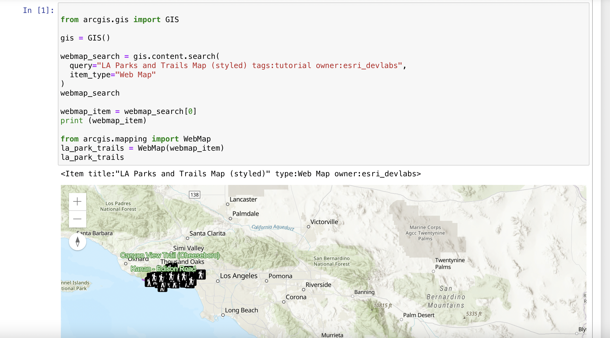

Reading and Displaying Files
================================

To read a file, we must first open the file. This is done using Python's built-in open() function. The open() function returns a file object, which has a read() method for reading  files and storing their contents as variables .  Once a file is read and stored as a variable, the original file can be closed.  We can then loop through the file variable and do stuff with its contents.

.. code-block:: python

	file = open("/Users/student/Desktop/Equakes2.csv", "r")
	text = file.readlines()
	file.close()

	for line in text:
	    print (line)

**Data**

* `Download Earthquake Data <https://corgis-edu.github.io/corgis/csv/earthquakes/>`_

* You can also download earthquake data from the `USGS website <https://earthquake.usgs.gov/earthquakes/search/>`_.

*Points to Note anout the Above Code*

1. The open method has the following modes:

  | ‘r’ – Python read file. Read mode is used when the file is only being read
  | ‘w’ – Python write file. Write mode is used to edit and write new information to the file (any existing files with the same name will be erased when this mode is activated)
  | ‘a’ – Python append file. Append mode is used to add new data to the end of the file; that is new information is automatically amended to the end
  | ‘r+’ – Special read and write mode is used to handle both actions when working with a file

2.  Always close the file after reading or writing to it. In most cases, upon termination of an application or script, a file will be closed eventually. However, there is no guarantee when exactly that will happen. This can lead to unwanted behavior including resource leaks and unwanted behavior.

|

Writing File Paths
--------------------

In Python, it is better not to write your file paths with backslashes as shown below:

.. code-block:: python

	file = open("C:\Users\student\Desktop\earthquakes.csv", "r")

Writing paths with backslashes is not advisable because a Python string can contain special characters that also incorporate backslashes for other reasons, e.g.,  "\t" (tabs),  "\n" (newlines), "\r" ( carriage returns), etc.

These special characters make it very hard to create a file path that uses single backslashes because file paths in Windows also use single backslashes. There are several workarounds:

**1. Use Forward Slashes**

.. code-block:: python

   file = open("C:/Users/student/Desktop/earthquakes.csv", "r")

|

**2. Use Raw Strings**

These are regular strings, but includes an r before the script begins.  The r tells the Python Interpreter that the string does not contain any special characters or escape characters.

.. code-block:: python

   file = (r"C:\Users\student\Desktop\earthquakes.csv")

|

**3. Use Double Backslahes**

In this case, the backslashes are escaped using a second backslash.

.. code-block:: python

   "C:\\Users\\student\\Desktop\\earthquakes.csv"

|

**4.  Use os.path.join**

The os module provides access to operating system functions regardless of the platform you are using, i.e, Windows, Mac OS, Linux, etc. 

os.path.join() takes any number of path strings and returns a single path using the platform-specific path separator.  

To create a string specifically for the Windows environnment, we can write the os.path.join() string as shown below.

.. code-block:: python

	import os
	os.path.join("c:/", "Windows")

	>>> 'c:/Windows'

To create a string for a platform regardless of whether it is Windows, Mac OS, Linux, etc., we can write the os.path.join() string as shown below. In this situation, the operating system will take care of the separator.

.. code-block:: python

	import os
	os.path.join('c:', os.sep, 'mydata')
	
	>>> 'c:\\mydata'

Note: os.sep will supply the separator

|

Opening a file using the "With" Statement
------------------------------------------

A second way second way to open a file is to use the "with" statement.  The with statement automatically takes care of closing the file once it leaves the with block, even in cases of error. I highly recommend that you use the with statement as much as possible, as it allows for cleaner code and makes handling any unexpected errors easier for you.

.. code-block:: python

	with open("/Users/student/Desktop/Equakes2.csv", 'r') as file:
	   text = file.readlines()
	for line in text:
	   print (line)

|

Opening a csv file using Basic Python Statements
-------------------------------------------------

Let's open a csv data file using some basic Python statements. First, we will let Python read the file and create a file object. Next, we will split the file contents into inidividual columns, and then store the column data in variables. This is a long-winded way of displaying csv files, but 
the objective with this code sample is to illustrate some details that is involved in opening these files.  For regular work, we use libraries such as Pandas which it much easier to display the csv files. Pandas will be discussed shortly.

.. code-block:: python

	infile = open("/Users/student/Desktop/earthquakes.csv", 'r') 
	lines = infile.readlines() 
	infile.close() 

	del lines[0] # Remove the first line
	#Create empty lists 
	xvar = [] 
	yvar = []
	count = 0

	for line in lines:
	    elements = line.split(",") # splits the line
	    mag = float(elements[2]) # Get the data in the third column
	    dep = float(elements[3]) # Get the data in the fourth column

	    # Add magnitude and depth data to the empty lists 
	    xvar.append(dep) 
	    yvar.append(mag)

	#Print the two lists as columnss

	magnitude = "Magnitude"
	depth = "Depth"

	print ("%-15s %s" %(magnitude, depth))
	print ("")

	for c1, c2 in zip(xvar, yvar):
	    print ("%-15s %s" % (c1, c2))

*Things to Look up in the above Code*

a. `Formatting Output <https://python-course.eu/python-tutorial/formatted-output.php>`_
b. `Python Zip Function <https://www.programiz.com/python-programming/methods/built-in/zip>`_

|

**Performing Calculations and Making a Graph**

.. code-block:: python

	import math
	import matplotlib.pyplot as plt
	infile = open("C:/Users/student/Desktop/earthquakes.csv, 'r')
	lines = infile.readlines()
	infile.close()
	del lines[0] # Remove the header line

	#Create empty lists
	xvar = []
	yvar = []
	std_dev = []
	count = 0
	sum = 0
	for line in lines:
	    elements = line.split(",") #splits the lines
	    mag = float(elements[4]) # Get the data in the fifth column
	    count = count + 1

	    # Add count and magnitude data to the empty x,y lists
	    xvar.append(count)
	    yvar.append(mag)
	    sum = sum + mag

	    #Calculate mean
	    average = sum / count

	print ("Average is",average)
	print ("")

	width = 1

	plt.figure(figsize=(4, 8)) 
	plt.bar(xvar, yvar, width, facecolor='orangered')
	plt.xlabel("No. of Earthquakes", fontweight='bold', fontsize='17', color = 'orange')
	plt.ylabel("Magnitude", fontweight='bold', color = 'orange', fontsize='12')
	plt.title("Magnitude of Earthquakes")
	plt.show()

|

*Things to Look up in the above Code*

`Anatomy of a Matplotlib Figure <https://matplotlib.org/2.0.2/faq/usage_faq.html>`_ 
`Pyplot Tutorial <https://matplotlib.org/stable/tutorials/introductory/pyplot.html>`_

|

|

Reading CSV Files Using Pandas
-----------------------------------

The script above used many lines of code to open the csv file, compute average, and plot a graph.  We can achieve the same results with far fewer lines of code by using a specialized library named Pandas.  Pandas is a very powerful, popular and easy to use Python library for data analysis.  It has many Excel-like functions. Its primary object is the DataFrame, which can be thought of as an abstract database table or spreadsheet.  Once you create a dataframe object, you can use it to display tables, plot columns, create and run queries, with just a few lines of code. 

 
Let's plot the earthquake dataset using Pandas. 

.. code-block:: python

	import pandas as pd
	df = pd.read_csv("../earthquakes.csv")
	df

|

**Displaying Specific Columns of your Dataframe**

To select multiple columns, use a list of column names within the selection brackets [].  In the example below, we are selecting the earthquake depth and magnitude fields. 

.. code-block:: python
 
	import pandas as pd
	df = pd.read_csv("../earthquakes.csv")
	df[['depth', 'magnitude']]

|

Get the size of the table.

.. code-block:: python

	import pandas as pd
	df = pd.read_csv("../earthquakes.csv")
	df[["depth", "mag"]].shape

|

**Filtering the Data Frame for Certain Rows**

.. code-block:: python

   import pandas as pd
   df = pd.read_csv("../earthquakes.csv")
   above_3.5 = df[["mag"] > 3.5]
   above_35.head()

|

Plotting Graphs
-----------------

Many types of graphs can be plotted by pandas. Below are seven types of graphs that are useful to know how to create.

The kind parameter accepts eleven different string values and determines which kind of plot you’ll create:

   | "area" is for area plots.
   | "bar" is for vertical bar charts.
   | "barh" is for horizontal bar charts.
   | "box" is for box plots.
   | "hexbin" is for hexbin plots.
   | "hist" is for histograms.
   | "kde" is for kernel density estimate charts.
   | "density" is an alias for "kde".
   | "line" is for line graphs.
   | "pie" is for pie charts.
   | "scatter" is for scatter plots.

|

**Line Graph**

.. code-block:: python

	import matplotlib.pyplot as plt
	import pandas as pd

	df = pd.read_csv("../earthquakes.csv")
	df.plot(kind='line',y='depth',color='red', figsize=(6, 8))
	plt.show()

|

**Histogram**

.. code-block:: python

	import matplotlib.pyplot as plt
	import pandas as pd
	df = pd.read_csv("../earthquakes.csv")

	#df.plot.line(column = df.columns[3],  figsize=(6, 8))

	df.plot(kind='hist',y='Depth_mls',color='red',bins = 10, figsize=(6, 8))
	plt.show()

|

**Bar Plot**

.. code-block:: python

   import matplotlib.pyplot as plt
   import pandas as pd

   speed = [0.1, 17.5, 40, 48, 52, 69, 88]
   lifespan = [2, 8, 70, 1.5, 25, 12, 28]
   index = ['snail', 'pig', 'elephant','rabbit', 'giraffe', 'coyote', 'horse']

   df = pd.DataFrame({'speed': speed,'lifespan': lifespan}, index=index)

   ax = df.plot.bar(rot=10)
   plt.title("Speed vs Lifespan, Selected Animals")
   plt.show()

|

**Scatterplot**

To plot the Depth and Magnitude Data as a scatterplot, write:

.. code-block:: python

	import matplotlib.pyplot as plt
	import pandas as pd
	df = pd.read_csv("../earthquakes.csv")

	df.plot(kind='scatter', x='depth',y='magnitude', color='red',figsize=(6, 8))
	plt.show()

or

.. code-block:: python

	df.plot(kind='scatter',x='Depth_mls',y='Magnitude',color='red')

	plt.show()

|

Writing to a File
--------------------

Once we are done with data analysis, we can also write to a file, as shown below.

.. code-block:: python

	with open("C:/Users/student/Desktop/john.txt", "w") as f:
	    f.write('Hello \n')
	    f.write('Hello \n')
	    f.write('Hello \n')
	    f.write('Hello \n')
	    f.write('Hello \n')
	    f.write('Hello \n')
	    f.write('Hello \n')
	f.close

|

Reading a Data file into Python, splitting its contents by columns, and storing the columns in variables

.. code-block:: python
 
	infile = open("../earthquakes.csv, 'r') 
	lines = infile.readlines() 
	newfile=open("../newfile.txt",mode="a+",encoding="utf-8")

	del lines[0] # Remove the first line
	#Create empty lists 
	xvar  = [] 
	yvar  = []
	count = 0
	sum   = 0

	for line in lines:
	     elements = line.split(",") # splits the line
	     mag = float(elements[4]) # Get the data in the fifth column 
	     count = count + 1

	     # Add count and magnitude data to the empty x,y lists 
	     xvar.append(count) 
	     yvar.append(mag)
	     sum = sum + mag
	     newfile.write("\n")
	     newfile.write(str(mag))

	#Calculate mean
	average = sum / count
	newfile2.write(str(average))
	infile.close()
	print ("The average earthquake magnitude is",round(average, 2))
	print ("")

|

Plotting Shapefiles
--------------------

**Displaying Shapefiles using Geopandas**

A large part of geospatial visualization is made possible using libraries such as Geopandas, Shapely, matplotlib, GDAL, OGR, and descartes.  Geopandas is perhaps one of the most popular libraries for plotting shapefiles. This because it only requires a few lines of code to plot a shapefile. I strongly recommend using Geopandas to display your shapefiles.

To use Geopandas, first, download and install the library to your Python installation.  Afterwards, import the library and use it in your code.  

As an example, run the code below in your favorite development environment to load a shapefile into Python using Geopandas.  Note that the code draws the shapefile with a single color because no specific column is being plotted.

.. code-block:: python

   import geopandas as gpd
   import matplotlib.pyplot as plt

   geo_df = gpd.read_file ("../Michigan.shp")
   geo_df.plot()

.. image:: img/michigan_single_color.png
   :alt: Michigan Map

|

**Viewing the Shapefile's Attribute Table using Geopandas**

To view the attribute table of a shapefile, wit the Geopandas library,  use the head() method of the data frame object.

.. code-block:: python

   import geopandas
   import matplotlib.pyplot as plt
   gdf = geopandas("../Michigan.shp")

   #Show data in the attribute table
   print(gdf.head())

   #Display the shapefile
   f, ax = plt.subplots(1, figsize=(8, 11))

   gdf.plot(ax = ax, edgecolor='black')

   ax.set_title("Water Wells, Washtenaw County, Michigan", fontdict={'fontsize': '14', 'fontweight' : '3'})

   plt.show()

.. image:: img/michigan_attribute_table.png
   :alt: Michigan Map

|

**Creating a Graduated Color Thematic Map using Geopandas**

Often in GIS, we are interested in creating graduated color thematic maps based on specific columns. To do, simply enter parameters in the gpd.plot() method, as shown below.

*gdf.plot(ax = ax, column= 'HISPANIC', cmap='OrRd' , scheme='fisher_jenks', legend=True, edgecolor='black')*

.. code-block:: python

   import geopandas
   import matplotlib.pyplot as plt
   gdf = geopandas.read_file("../Michigan.shp")

   #Display the shapefile
   f, ax = plt.subplots(1, figsize=(10, 13))

   gdf.plot(ax = ax, column= 'HISPANIC', cmap='OrRd' , scheme='fisher_jenks', legend=True, edgecolor='black')

   ax.set_title("Moble Homes, Michigan", fontdict={'fontsize': '20', 'fontweight' : '3'})

   plt.show()

   #Save the map
   f.savefig("/Users/student/Downloads/Michigan_Counties/map_export.png", dpi=300)

.. image:: img/michigan.png
   :alt: Thematic Map

See the `Geopandas User Guide <https://geopandas.org/en/stable/docs/user_guide/mapping.html>`_ for more information.

|

**Displaying a Shapefile Using PyShp**

Pyshp is an open source library that can be used to display a shapefile using pure Python. The project is described at this `website <"https://pypi.org/project/pyshp/">`_.  PyShp code for displaying a shapefile is lengthier than the one used by geopandas, but it gives us an opportunity to learn about multipart polygons and polylines.   Please note that after installing the "Pyshp" library, it is imported into Python using the shapefile keyword, e.g., "import shapefile".   

Prior to running the code,it is useful to know that shapefiles have a 'parts collection' and a 'points collection'.  A parts collection keep is used tp keep track of the number of polygons or line segments associated with each record.  This is required because in many situations, several polygons or polylines must be linked to one record in the attribute table.  As an example, since Hawaii is made up of several islands, multiple polygons are needed to represent the state, however in the attribute table, only a single record is used to represent the state. 

In a shapefile, a record with one polygon will have one part, but this will show in the parts collection as 0.  This is because the counting system begins with zero. 

A points collection refers to the list of points associated with a shape or feature. When working with points collection, be aware that the x-coordinates have an index of [0] while the y-coordinates will have an index value of [1].  This allows us to retrieve the x and y coordinates as separate lists.

The illustration below shows how we visualize the relationships between a parts collection and a points collection.  The upper section of the illustration shows the polygons associated with a single record while the lower section shows the part and points collection associated with the polygons.  Since there are two polygons associated with the record, the parts collection for that record is 1 because the count starts from zero.

The values in the squares in the parts collection represent index numbers that keep track of the starting coordinates for each part. Thus, the first part has coordinates that go from from p1 to p6. The second part starts from index value 6, and has coordinates that go from p7 to p11.

.. image:: img/point_parts_collection.png
   :alt: Parts and Point Collection of a Shapefile

Using Pyshp we can experiment with displaying a shapefile using only its points collection and with both its parts and points collection. The code below shows how to display a shapefile using only its points collection.   

.. code-block:: python

   import matplotlib.pyplot as plt 
   import shapefile 
   sf = shapefile.Reader("../Michigan.shp")

   plt.figure(figsize=(7,8)) 
   for each_rec in sf.shapeRecords(): 
	   x = [i[0] for i in each_rec.shape.points] 
	   y = [i[1] for i in each_rec.shape.points]
	   plt.plot(x,y, color="gray")

	plt.show()
|

The code below plots a Michigan shapefile using both the parts and points collection.  This is a much better way to plot the shapefile. To display the parts and points of a shapefile, the code must first get the number of parts associated with each polyline or polygon, then loop through each part to get the array of points for the part. 

.. code-block:: python

	import shapefile as shp
	import matplotlib.pyplot as plt

	sf = shp.Reader("../Michigan.shp")

	plt.figure(figsize = (7,8))

	# loop through each record in the shaperecords collection 
	for each_rec in sf.shapeRecords():
	    for i in range(len(each_rec.shape.parts)):   
	        i_start = each_rec.shape.parts[i]   #Get the starting values for the part.
	        if i==len(each_rec.shape.parts)-1: 
	            i_end = len(each_rec.shape.points)  #Get the length of the points collection.
	        else:
	            i_end = each_rec.shape.parts[i+1]  

	        #Get the X,Y coord of the points in each part and make a list
	        x = [i[0] for i in each_rec.shape.points[i_start:i_end]]
	        y = [i[1] for i in each_rec.shape.points[i_start:i_end]]
	        plt.plot(x,y, color = "green")
	        
	plt.show()

|

**Displaying Polygon or multi-polygon Shapefiles using Descartes**

The Descartes library is another alternative for displaying shapefiles using Python.  Descartes uses geometric objects as input for displaying `matplotlib paths and patches as lines and polygons <https://matplotlib.org/stable/api/pyplot_summary.html>`_.   Experiment with the code below to learn about _geo_interfaces_ from the shapefile library,  add_patch() from matplotlib, and PolyPatch () from Descartes.

.. code-block:: python
   
   import shapefile as shp
   import matplotlib.pyplot as plt
   from descartes import PolygonPatch

   sf = shp.Reader("../School_Districts.shp")
   fig = plt.figure()

   ax = fig.gca()

   for poly in sf.shapes():
	   poly_geo=poly.__geo_interface__
	   ax.add_patch(PolygonPatch(poly_geo, fc='#6699cc', ec='#000000', alpha=0.5, zorder=2 ))

	ax.axis('scaled')
	plt.show()

.. image:: img/school_districts_descartes.png
   :alt:  Shapefile Displayed with Descartes

	

|

In this example, the code above has been modified to display the polygons in the shapefile with multiple colors.

.. code-block:: python

   import shapefile as shp
   import matplotlib.pyplot as plt
   from descartes import PolygonPatch
   import random

   sf = shp.Reader("/Users/hsemple/Desktop/Lab6_Shapefiles/school_districts.shp")
   fig = plt.figure()

   ax = fig.gca()

   for poly in sf.shapes():
	   poly_geo=poly.__geo_interface__

	   # Generate a random number between 0 and 2^24
	   color = random.randrange(0, 2**24)

	   # Convert the number from base-10 (decimal) to base-16 (hexadecimal)
	   hex_color = hex(color)

	   std_color = "#" + hex_color[2:]

	   ax.add_patch(PolygonPatch(poly_geo, fc= str(std_color), ec='#000000', alpha=0.5, zorder=2 ))

  ax.axis('scaled')
  plt.show()

.. image:: img/school_districts_multi_color.png
   :alt:  Shapefile Displayed with Descartes

|

**Displaying a List of XY Coordinates as Points**

.. code-block:: python

   # importing libraries
   import pandas as pd # Reading csv file 
   from shapely.geometry import Point # Shapely for converting latitude/longtitude to geometry
   import geopandas as gpd # To create GeodataFrame

   import matplotlib.pyplot as plt

   earthquakes = pd.read_csv('/Users/hsemple/Desktop/earthquakes.csv')
   print (earthquakes.head())

   # creating a geometry column 
   geometry = [Point(xy) for xy in zip(earthquakes['longitude'], earthquakes['latitude'])]

   # Coordinate reference system : WGS84
   #crs = {'init': 'epsg:4326'}

   # Creating a Geographic data frame 
   gdf = gpd.GeoDataFrame(earthquakes, geometry=geometry)

   #print (gdf.head())

   # Plot all points
   gdf.plot(marker='o', color='b', markersize=0.5)

   plt.show()

   |

.. raw:: html

    <iframe width="560" height="315" src="https://www.youtube.com/embed/aVkdWSqKG_c" title="YouTube video player" frameborder="0" allow="accelerometer; autoplay; clipboard-write; encrypted-media; gyroscope; picture-in-picture; web-share" allowfullscreen></iframe>

|

|

Displaying Rasters
--------------------

**Arrays**

In programming, rasters are considered as arrays, therefore we learn about arrays in order to manipulate rasters.  

An array is a collection of items of the same data type that can be manipulated as a single entity.  In Python,  a list is a one dimensional array.  However, when we are thinking about rasters, we are typically thinking of two dimensional arrays that are matrices of numbers defined by rows and columns.  

In Python, one difference between a list and a two-dimensional array is that whereas a list can store multiple data types, a two-dimensional array can store only one data type.  

.. image:: img/arrays1.png
   :alt: One and Two Dimensional Arrays

Python has specialized libraries for manipulating arrays. Two popular ones are the "numpy" library and the “array" module. Numpy appear to be more popular.  To import Numpy, type:    

>>> import numpy as np

To learn more about arrays, please click on `this link <https://jakevdp.github.io/PythonDataScienceHandbook/02.02-the-basics-of-numpy-arrays.html>`_.

|

**Displaing a DEM using GDAL and Matplotlib** 

One way to display a raster is to open the raster file using the gdal library, then convert the raster into an using GDAL. Afterwards, we can use pyplot.imshow() to display the array.    If you not familiar with imshow, please look it up.

.. code-block:: python

   import numpy as np
   import gdal
   import matplotlib.pyplot as plt

   #Open raster and read number of rows, columns and bands
   ds = gdal.Open("/Users/hsemple/Downloads/Wayne_DEM/county/wayne/topography/dem")

   band1 = ds.GetRasterBand(1)

   raster_array = band1.ReadAsArray()
   plt.imshow(raster_array)
   plt.show()

|

**Displaying a Raster using Rasterio and Matplotlib**

Rasterio is a popular open source Python library used for viewing and manipulating rasters.  Rasterio utilizes the gdal library to display rasters. With rasterio, viewing a raster can be done with just a few lines of code, like the example below. 

Rasterio has a show( ) method for displaying rasters. However, the library also uses pyplot’s imshow method to display the data.

.. code-block:: python

   import rasterio
   from matplotlib import pyplot

   src = rasterio.open("/Users/student/Downloads/Wayne_DEM/county/wayne/topography/dem")
   src_array = src.read(1)

   fig, ax = pyplot.subplots(1, figsize=(8, 5))
   img = ax.imshow(src_array) # Get the plot renderer object.

   fig.colorbar(img, ax=ax) #Associate the figure object with plot renderer and axes objects.
   ax.set_aspect('auto') #Let the axes object set the length of the colobar. 

   pyplot.show()

`Source <https://shakasom.medium.com/how-to-convert-latitude-longtitude-columns-in-csv-to-geometry-column-using-python-4219d2106dea>`_

.. image:: img/rasterio_dem1.png
   :alt: Wayne DEM

|

**Displaying a three-band Aerial Photo with GDAL**

.. code-block:: python

  import numpy as np
  from osgeo import gdal
  import matplotlib.pyplot as plt

  aerial = gdal.Open("/Users/semple/Desktop/Detroit.png
    

  bnd1 = aerial.GetRasterBand(1)
  bnd2 = aerial.GetRasterBand(2)
  bnd3 = aerial.GetRasterBand(3)

  #Now turn each band into a ndarray:
  img1 = bnd1.ReadAsArray()
  img2 = bnd2.ReadAsArray()
  img3 = bnd3.ReadAsArray()    

  #Then stack them to have a 3 band image
  img = np.dstack((img1,img2,img3))

  plt.imshow(img)    
  plt.show()

|

**Displaying Satellite Imagery with GDAL**

.. code-block:: python

   import numpy as np
   from osgeo import gdal
   import matplotlib.pyplot as plt

   
   #Image-2019
   band5 = "/Users/hsemple/Downloads/Landsat/LT05_L1TP_019031_20111106_20160830_01_T1_B5.TIF"
   band4 = "/Users/hsemple/Downloads/Landsat/LT05_L1TP_019031_20111106_20160830_01_T1_B4.TIF"
   band3 = "/Users/hsemple/Downloads/Landsat/LT05_L1TP_019031_20111106_20160830_01_T1_B3.TIF"
 

   #Open the Landsat image bands with GDAL

   B5_data = gdal.Open(band5)
   B4_data= gdal.Open(band4)
   B3_data = gdal.Open(band3)

   B5_Array  = B5_data.GetRasterBand(1).ReadAsArray().astype(np.float32)
   B4_Array = B4_data.GetRasterBand(1).ReadAsArray().astype(np.float32)
   B3_Array = B5_data.GetRasterBand(1).ReadAsArray().astype(np.float32)

   #Then stack them to have a 3 band image
   img = np.dstack((B5_Array,B4_Array,B3_Array))

   plt.imshow(img)    
   plt.show()

|

**Displaying a Three-band Raster with Rasterio**

Rasterio is a popular open source Python library used for viewing and manipulating rasters.  Rasterio utilizes the gdal library to display rasters. With rasterio, viewing a raster can be done with just a few lines of code, like the example below. 

Rasterio has a show( ) method for displaying rasters. However, the library can also use pyplot’s imshow method to display the data. The example below uses the show method.

.. code-block:: python

  import rasterio
  from rasterio.plot import show
  src = rasterio.open("/Users/semple/Desktop/Detroit.png")

  show(src)

|

**Displaying a Raster in QGIS Using Python**

.. raw:: html

    <iframe width="560" height="315" src="https://www.youtube.com/embed/W5_3H2UWYms" title="YouTube video player" frameborder="0" allow="accelerometer; autoplay; clipboard-write; encrypted-media; gyroscope; picture-in-picture; web-share" allowfullscreen></iframe>

|

**Displaying a Web Map that is Stored in ArcGIS Online Using ArcGIS API for Python**

The code sample below makes an anonymous connection to ArcGIS Online then searches for Search for a publicly available web map titled LA Parks and Trails Map owned by esri_devlabs. The web map contains datasets about Los Angeles, CA parks and trails.  After the web map is retrieved from the list of items,  the WebMap class is imported and used to visualize the web map.  The code sample comes from `this ESRI webpage <https://developers.arcgis.com/python/guide/display-a-webmap>`_ 

.. code-block:: python

   from arcgis.gis import GIS

   gis = GIS()

   webmap_search = gis.content.search(
      query="LA Parks and Trails Map (styled) tags:tutorial owner:esri_devlabs",
	  item_type="Web Map"
	)
	
	webmap_search

	webmap_item = webmap_search[0]
	print (webmap_item)

	from arcgis.mapping import WebMap
	la_park_trails = WebMap(webmap_item)
	la_park_trails

|

Exercises
-----------

1. Visit `this NFL website <https://nextgenstats.nfl.com/stats/passing#max-completed-air-distance>`_ and copy the quarter back data. Paste the data into Excel and save it in CSV format.  Use the standard library in Python or pandas to plot a simple histogram and boxplot of the data in the passing attempts field (ATT).   Also, calculate the mean and standard deviation of passing attempts.   Explain what your data is portraying in short paragraph.

2. Using Geopandas, create a thematic map for the USA or `Michigan <https://www.michigan.gov/coronavirus/stats>`_ showing the distribution of Covid19 cases across the country or state for the date for which you have data.  Write comments to explain what your code is doing.   Repeat the process using another Python library of your choice.

3. This Module has sample code for displaying digital elevation models using GDAL and the rasterio libraries.  Download a DEM and display it using either the GDAL or Rasterio library.  Afterward, tweak the code so that you can easily change the color of the displayed raster. Also, display the legend with the correct elevation values (not negative values).

4. Extend the sample code in this Module that uses Descartes to display shapefiles in which the polygons are labeled.

5. Complete the tutorial on this website inclduing the challenge task at the end - https://blog.matthewgove.com/2021/06/18/the-ultimate-in-python-data-processing-how-to-create-maps-and-graphs-from-a-single-shapefile/

6. Review `the tutorial on this page <https://pynative.com/python-matplotlib-exercise/>`_and be prepared to discuss the code, particularly how Matplotlib is how used.

7. Modify the ArcGIS API for Python code above to enable you to log into your own ArcGIS Online account and display a web map.

|

Resources
-----------

* https://automating-gis-processes.github.io/CSC18/index.html
* Python Shapefile Library - https://pythonhosted.org/Python%20Shapefile%20Library/
* Land Cover Change Analysis with Python and GDAL - Tutorial - https://hatarilabs.com/ih-en/land-cover-change-analysis-with-python-and-gdal-tutorial
* Rasterio - https://geobgu.xyz/py/rasterio.html#
* Create Random Hex Color Code Using Python - https://www.geeksforgeeks.org/create-random-hex-color-code-using-python/#
* Plotting large shapefiles with matplotlib - https://gis.stackexchange.com/questions/202839/plotting-large-shapefiles-with-matplotlib/266675#266675

|

