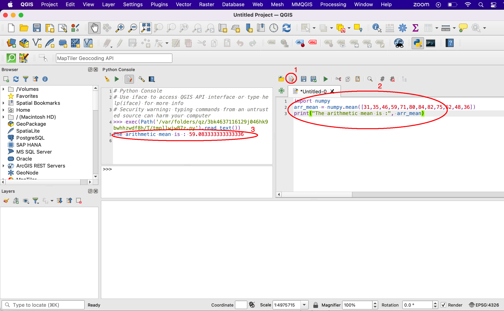

Development Environments
==========================

For these tutorials, we will run our Python scripts in the following development environments depending on what needs to be accomplished: the Standard Python Distribution, Anaconda Distribution, ArcGIS Pro, ArcGIS API for Python, and QGIS. This will give users an opportunity to familiarize themselves with these various platforms.

|

The Standard Python Distribution 
-----------------------------------

Many people use the standard Python distribution as the central platform for development. Scripts are in executed in IDLE, which is Python's default integrated development environment.  By default, the standard Python distribution lacks many packages that are needed for GIS and related work so you will have to install these manually. Sometimes, installing these packages and their dependencies can be challenging, but these challenges are great opportunities for learning the inner details of Python.

1. To download the Standard Python Distribution, visit Python's `homepage <https://www.python.org/downloads/>`_. Download the latest version.

2. If you are using a Windows computer, after downloading, install the program on your computer.

 .. image:: img/install_python.png
   :alt: Install Python

3. If you are using a mac computer, first download and install `Homebrew <https://brew.sh/)>`_ . Homebrew is a package manager that helps users to quickly install software packages on Mac computers using the command line.  Prior to installing homebrew, you need to install Xcode’s Command Line Tools. Xcode is a macOS integrated development environment (IDE). You can use it to make apps for all mac OSs, iOS, iPad OS, watch OS, and tv OS. To download and install it, run the following command in the Terminal:

   >>> xcode-select --install

4. Accept starting the installation and the license and it will be installed automatically.

5.  To install Homebrew automatically, run the command below:

 >>> /bin/bash -c "$(curl -fsSL https://raw.githubusercontent.com/Homebrew/install/HEAD/install.sh)"

6. After installing Python on Windows or macOS check the version of Python that will be run from the command prompt. To do this type:

     >>> which python3

7. You should get  /usr/local/bin/python3 or something similar.

8. Check also that the Python 3x Directory has been added to your System Path Environment Variable.  To check for this type, type:
    
  >>> $PATH

9. To install new packages, you need to use Pip.  The basic structure of the command is "pip install <package_name>". To install a library nameD *matplotlib*, type:

    >>> pip install matplotlib

   
10. To begin entering code into Python, start either the Python Interpreter or IDLE then enter the code.  

 .. image:: img/interpreter_idle.png
   :alt: Python Interpreter and IDLE

|

Python Virtual Environments
-----------------------------

When working with Python, it is a good idea to work with virtual environments. Virtual environments are isolated environments that Python developers can use to install and run packages for a specific project.  Thus, instead of installing the packages for the entire system, users can install the packages needed for a particukar project. This allows each project to have its own dependencies, regardless of what dependencies other projects may be using.   

**How to Install and Create Virtual Environment**

1. At the Python prompt, type

>>> pip3 install virtualenv

2. Make a new directory to keep all your virtual environments in one place.

>>> mkdir python-virtual-environments && cd python-virtual-environments

3. Create a new virtual environment inside the 'python-virtual-environments' directory.

>>> python3 -m venv project_env

4. To activate the 'project_env virtual envirnonment' you created in the previous step, run the code below.  

>>> source project_env/bin/activate

5. Notice how your prompt is now prefixed with the name of your environment (project_env, in our case). This indicates that 'project_env' is currently active, which means the python executable will only use this environment’s packages and settings.

6. To stop using the virtual environment, run the code below.

>>> deactivate
 

|

 
Jupyter Notebook in Anaconda 
------------------------------

Anaconda is a large Python distribution that has become very popular over the last several years.  One reason for its popularity is that it comes  pre-installed with many packages. Also, users can run their code using Jupyter Notebook, which is a nice, browser-based environment for running code. I strongly recommend that you use Jupyter Notebook as much as you can for your Python GIS programming.

1. Download the Anaconda Distribution at `this site <https://www.anaconda.com/products/distribution>`_ (https://www.anaconda.com/products/distribution). 

2. After intallation, start Anaconda, then launch the Jupyter Notebook. 

 .. image:: img/jupyter_notebook.png
   :alt: Anaconda Navigator

3. Click on this `link <https://www.edlitera.com/en/blog/posts/guide-how-to-start-jupyter-notebook#mcetoc_1gcqvj0h63>`_ (https://www.edlitera.com/en/blog/posts/guide-how-to-start-jupyter-notebook#mcetoc_1gcqvj0h63) for information on how to open a Jupyter Notebook on macOS or Windows.  The Jupyter development environment should appear as shown below.

 .. image:: img/jupyter_dev_environment.png
   :alt: Jupyter Notebook Development Environment

4. If you need to install new package, including spatial packakes, look for the Anaconda folder at the Windows Start button, then click on Anaconda prompt.  When the Anaconda prompt appears, enter the command below to install a new package. Conda installs many packages with ease, so you should use it often.

           conda install package_name

5. Alternatively, you can install new packages from within Anaconda Navigator. This works for either Windows or macOS.

 .. image:: img/install_packages.png
   :alt: Anaconda Navigator Environment

 
|

Jupyter Notebook within ArcGIS Pro
-------------------------------------

1. If you have ArcGIS Pro installed on your computer, you can run Python using Jupyter Notebook that is installed with ArcGIS Pro.  This is a good development environment to use  as the connection between Python and Jupyter Notebook is already configured.   

2. To run Python using Jupyter Notebook that is installed with ArcGIS Pro, open ArcGIS Pro, then click on Project | Python | Python Notebook, This shown in the illustration below.

 .. image:: img/jupyter_notebook_arcgis_pro.png
   :alt: Python's Notebook in ArcGIS Pro 

3. If you wish to add new libraries to ArcGIS, you will first have to clone Python's default environment in ArcGIS Pro then install the new libraries to the cloned environment.  This `ESRI tutorial <https://support.esri.com/en/technical-article/000020560>`_ shows how to clone Python's default environment within ArcGIS Pro.
 

 

|

Python Window in ArcGIS Pro 
-----------------------------

1. In ArcGIS Pro, click on Project | Python | Python Window.  
  

 .. image:: img/jupyter_notebook_arcgis_pro2.png
   :alt: New Python Notebook

  
 2. This opens the Python window.
   

 .. image:: img/arcgis_python_window.png
   :alt: ArcGIS Python Notebook

3. The top section of the Python Window is called the transcript. The bottom section is called the prompt. The transcript is initially blank. The transcript provides a record of previously entered code and its results.

4. The prompt is where you type your code. When the Python window first opens, the message in the prompt reads Initializing Python interpreter, which means the window is getting ready to receive your code. After a few seconds the message is replaced with Enter Python code here, which means you can start typing your code. See this link for a tutorial.
 

|

ArcGIS API for Python
-----------------------

The ArcGIS API for Python is distributed as a conda package named *arcgis*. It can be run from within Anaconda and other Python Distributions.  See this `hyperlink <https://developers.arcgis.com/python/guide/install-and-set-up/>`_ for more information. 

|

The Python Console within QGIS
---------------------------------

**Running Python from the Console Shell**

1. Open QGIS.  From the main menu in QGIS, select Plugins | Python Console.  This will cause the Python Console to appear. It may open up towards the bottom of the application, however, if you wish, you can detach it from the main window and place it whereever you wish.

 .. image:: img/qgis_python_console1.png
   :alt: New Python Notebook

2. The lower part of the Console display with the >>> prompt. This is is where you type commands.  

3. The Python statements can be pure Python commands that have nothing to do with QGIS, or they can be Python statements ained at manipulating QGIS cser data i QGIS.

|

**Accessing the QGIS Python Editor**

1.  The editor is used to write scripts that are too lengthy to be edited and executed from the Console Shell.   It can be accessed by clicking "Show Editor" in the upper part of the console.

2.  To illustrate the use of the editor, we will execute a simple script to print the mean of a set of numbers. The script is provided below along with an illustration of how it appers in QGIS.

.. code-block:: python
   :linenos:

   import numpy
   arr_mean = numpy.mean([31,35,46,59,71,80,84,82,75,62,48,36])
   print("The arithmetic mean is :", arr_mean)

|

Jupyter Notebook with QGIS
-----------------------------

1. It is possible to run Jupyter notebook from within QGIS.  First, you must install the pyqgis modules into an environment. After than, you can with QGIS outside of the application itself. 

2. Create a Python GIS environment  - https://lerryws.xyz/posts/Install-Jupyter-Notebook-in-QGIS3

|

Resources
------------

* Getting Started With Python Programming (QGIS3) - https://www.qgistutorials.com/en/docs/3/getting_started_with_pyqgis.html

* Customizing QGIS with Python (Full Course Material) - https://courses.spatialthoughts.com/pyqgis-in-a-day.html

* GIS Python API documentation - https://qgis.org/pyqgis/master/

* PyQGIS Developer Cookbook - https://docs.qgis.org/3.16/en/docs/pyqgis_developer_cookbook/index.html

* Streamlining GIS with Automation - https://www.geospatialworld.net/prime/technology-and-innovation/streamlining-gis-with-automation/

* Getting started with Anaconda - https://docs.anaconda.com/anaconda/user-guide/getting-started/#open-nav-mac

* Python Virtual Environments - https://autogis-site.readthedocs.io/en/latest/course-info/create-python-gis-environment.html

* Python GIS environment - https://gist.github.com/ThomasG77/223064813d8aefda5b3cdb05c2588fa1

* QGIS Developers Cookbook - https://docs.qgis.org/2.18/pdf/en/QGIS-2.18-PyQGISDeveloperCookbook-en.pdf

* Getting Started With Python Programming - http://www.qgistutorials.com/en/docs/getting_started_with_pyqgis.html

 

