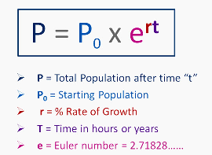

Introduction to the Python Language
=====================================

Python is an open-source programming language that can be used for a wide variety of programming tasks, from basic scripting to complex and intricate applications.

Python is also an interpreted language. This means that the program code is compiled into machine readable code at the moment it is run by the  interpreter.  This is in contrast to a compiled language like C++, or Java where the program code is compiled into machine readable code by a language compiler before the code is run. The compiler creates an executable in the machine's native language that can then be run many times.   

Python is also a dynamically typed language. This means that developers do not have to declare variables prior to using them. Additionally, Python is an object oriented language. The default installation is a set of core modules, but hundreds of libraries, e.g., SciPy, Numpy, Arcpy, etc., are available for specialized tasks. 

|

Basic Aspects of Python
--------------------------

In this module, we will look at the following aspects of the Python language:

* Hello World program
* Variables
* Data Types
* Comments
* Basic Python Statements
* Simple programs 

|

**Hello World Program**

Enter the line below in the Python development environment that you are working in and then run the code.  You will have to look up how to run the code in the development environment in which you are working.  Do not enter ">>>". That symbol indicates the Python's command prompt if there is one. 

>>> print('Hello, world!')
 

|

**Variables**

In programming, a variable is a memory location for storing values used in a program.  Values are assigned to variables using the assignment operator “=“, as shown below. Please note that variable names are case sensitive. A variable with the name "my_age" is not the same as a variable with the name "My_Age".
  
>>> my_age = 29           

In Python, we can create a name for a variable and then assign it a value in one statement. The values stored in variables may change during the course of program execution. 

Although a variable need not be assigned to any particular data type, if you want to specify the data type of a variable, this can be done with casting. For example: 

.. code-block:: python
    :linenos:
     
    x = str(10)      # x will be '10'
    y = int(55)      # y will be 55
    z = float(3.8)   # z will be 3.8

|

**Data Types**

Data type refers to how values in variables are classified.  The classification typically refers to what values are stored in the variable and what type of mathematical, relational or logical operations can be applied to the values without causing error.

Python has several data types. The list below comes from `W3Schools <https://www.w3schools.com/python/python_datatypes.asp>`_.  

* Numeric Types: 	     integers, float, complex
* Sequence Types: 	  list, tuple, range
* Mapping Type: 	     dictionary
* Boolean Type: 	     boolean
* Set Types: 	        set, frozenset
* Binary Types: 	     bytes, bytearray, memoryview
* None Type: 	        NoneType

|

Below are some basic details on popular data types you will encounter:

*Integers*

1. Integers are whole numbers, i.e., numbers without decimals, e.g, 23, 123, 4567, etc 

2. Integers are assigned to variables using the "=" sign.

   >>>  a = 10    # Normal assignment

3. Convert a number to integer

   >>> int(3.45)
       3

|

*Floats*

1. Floats are numbers that include decimals

2. To make sure a variable becomes a float, use a decimal somewhere in the declaration/calculations, e.g., 
 
   >>> pi = 3.1415927
   >>> f = 5.0 # declare float

3. To convert a number to a float, use the float function, e.g.,

   >>> float(3)
      3.0

|

*Dictionaries*

A dictionary is a data structure used to store groups of objects whose values occur in pairs. For example, one may have a list of students for which their grades need to recorded. We can use a set of key value to do this:

.. code-block:: python
    :linenos:

    grades = {'Robert' : 75,
    'Dawn' :90,
    'James' : 85,
    'Benjamn': 77,
    'Ingrid' :87,
    'Lester': 82}

In the example above, the names of the students is called the key while the test scores are the values.  A dictionary allows many operations to be performed on the key value pairs.  For example, new key values pairs can be inserted into the dictionary while existing ones can be deleted.

|

*Lists*

Lists are collections of objects that may or may not be related to each other.  In Python, lists items are enclosed in square brackets and each item is separated by a comma, as shown below:

>>> a = ['foo', 'Tom', '12', '45']

|

*Tuples*

A tuple is a collection of items, similar to a list, but with the important distinction that the order of the items are fixed. This is important for storing certain values, for example, a list of coordinates for polygon or a line.  Whereas list items are enclosed in square brackets, tuple items are enclosed in parenthesis.

>>> coords = (51.901071, 7.543488, 52.002215, 7.692406)

|

**Comments**

Comments are plain descriptions of what your code is doing. Comments make it easy for you to debug, maintain and update your code. In Python, single line comments start with ‘#’ while multiple line lines are enclosed in triple quotes.

*Single Line Comments*

In the example below, the program uses two single line comments to remind the programmer what the line that follows is all about.

 .. code-block:: python
    
    #Get the user's input
    P1 = input("Please input the size of the first city: ")
     
    #Calculate the interaction between places
    PI= (int(P1)*int(P2))/(float(Distance)*float(Distance))

*Multiple Line Comments*

The example below shows how multiple line comments are written.  Either single quotes or double quotes can be used, but they can't be mixed.

.. code-block:: python

    ''' I'm very long-winded and I really need to take up more than one line. 
    That way I can say all the very important' things which I must tell you.  
    Strings like me are useful when you must print a long set of instructions, etc.'''      

    P1 = input("Please input the size of the first city: ")
    PI= (int(P1)*int(P2))/(float(Distance)*float(Distance))

|

**Program Statements**

In programming, a statement is a line of code that expresses some action to be carried out.  A program is a sequence of statements directed at solving a problem.  The program in the example below consists of four statements aimed at converting kilometers into miles.

.. code-block:: python

    kilometer = float (input ("Please enter the kilometer to covert _ "))
    conversion_ratio = 0.621371
    miles = kilometer * conversion_ratio
    print ("The converted value is:", miles)

 

|

Practice Programs 
------------------

The scripts below are intended to show how to use Python statements to create programs.  The programs are all sequential meaning that each line in the program is run after the preceding line.  There is no branching or repeating of operations.

The first six examples do not require any specialized Python packages. They can all be run using Python's standard library. If you do not have a Python' interpreter already installed, you can can use the interpreter at this `website <https://www.programiz.com/python-programming/online-compiler/>`_

For Examples 7 through 10, the arcpy package must be loaded into memory using the import statement. If arcpy is not installed, the scripts will return an error.

**1.** Write a program to calculate the average of three scores. Key functions in the program below are the input function, the float function, and the round function.

.. code-block:: python

   # Get the three scores
   num1 = float(input("Enter the first number: "))
   num2 = float(input("Enter the second number: "))
   num3 = float(input("Enter  the third number: "))
   
   # Calculate the average
   average = (num1 + num2 + num3) / 3

   # Print out the test score
   print ("The average score is: ", round(average,2))

|

**2.**  Write a program to calculate the mean of a set of numbers.

If you have a list of 1,000 numbers and wish to find the mean of the set of numbers, then one approach is to use Python library is numpy that has a built-in function to calculate the mean.  The code below uses numpy.mean() to calculate the mean.  The function takes a list of numbers as an input. For more on this function, let's look at numpy's `documentation <https://numpy.org/doc/stable/reference/generated/numpy.mean.html#numpy.mean>`_  

.. code-block:: python

    import numpy

    arr_mean = numpy.mean([31,35,46,59,71,80,84,82,75,62,48,36]) 
 
    print("The arithmetic mean is :", arr_mean)

After calculating the mean of the dataset using numpy, search numpy's documentation and verify how to calculate other basic statistics such as minimum, maximum, standard deviation, and variance.

|

**3.** Write a program that converts temperature from Fahrenheit to Celsius.

Please note the formatting of the results in the print statement. The function, str(round(Celsius,2)), converts formats the results to two decimal places then converts the value to a string.   The plus sign concatenates or joins the first string with the second second string.

.. code-block:: python

   Fahrenheit = float(input("Enter the temperature in Fahrenheit: "))
   Celsius = (Fahrenheit - 32) * 5.0/9.0
   print (str(round(Celsius,2)) + " degrees Celsius")

 

|

**4.** Write a program to calculate the square root of a number

The purpose of the example below is to illustrate the use of string formatting when printing out statements, In the code below, %0.2f is placeholder that is also used used to format the floating-point number 'num_sqrt' with two digits after the decimal point.  The formatted place holder is included in the string. The variable appear at the end of the string preceded by a % sign. 

.. code-block:: python

   num = float(input('Enter a number: '))
   num_sqrt = num ** 0.5
   print ('The square root of', num, 'is %0.2f' % num_sqrt)

|

**5.** Write a program to calculate the area of a triangle.

.. code-block:: python

   # Get inputs from the user
   base = float(input('Enter length of the base of the triangle: '))
   height = float(input('Enter the height of the triangle '))

   # calculate the area of the triangle
   triangle_area = (base * height) / 2

   # Display the results
   print ('The area of the triangle is',  triangle_area)

|

**6.** Write a program to calculate the area of a circle.

In the script below, we are highlighting how to import one of Python's built-in modules, i.e., the math module into a script and use the pi unction from the math module to solve a problem. Note that the dot notation is used to show that the pi function is linked to the math module.  Without this association, Python would not where to look for the pi function.

.. code-block:: python

   
   #import the math library that contains math functions
   import math

   # Get inputs from the user
   radius = float(input("Enter the radius of the circle: "))

   # Perform calculation
   circle_area = math.pi * radius ** 2

   # Display the results
   print('The area of the circle is', circle_area)

   #format results
   print('The area of the circle is', round(circle_area,2))

|

**7.** Write a program that reads a simple text file with one entry per line.  Once the list is read and parsed, use it to calculate the mean. 

.. code-block:: python

    import numpy as np
    data = np.loadtxt("/Users/hsemple/Desktop/equqke_depth.csv", skiprows=1, dtype='float')

    print (data)
    
    arr_mean = numpy.mean([data]) 
    print("The arithmetic mean is :", round(arr_mean,4))

|

**8.** Write a program that calculates the spatial interaction between two places using a simple form of the gravity model.

.. image:: img/interaction.png
   :alt: Spatial Interpolation Concept

   

.. code-block:: python
   :linenos: 

   #Get the user's input
   P1 = input("Please input the size of the first city: ")
   P2 = input("Please input the size of the second city: ")
   Distance = input("Please input the distance between the two cities: ")
  
   # Calculate the interaction ,with output of decimal format
   PI = (int(P1)*int(P2))/(float(Distance)*float(Distance))

   #Print the result
   print (”The potential interaction between the two cities is", round(PI,2) )      

|

**6.**  Write a Python program to display the calendar for any given month of a specified year.

The script below illustrates how to import the calendar module and use a function from the calendar module. You can read about the `calendar module and its functions <https://docs.python.org/3/library/calendar.html?highlight=calendar#module-calendar>`_ in Python's documentation.

.. code-block:: python
   :linenos:

   #import calendar library
   import calendar

   # Get the month and year from the user
   yy = int(input("Enter year: "))
   mm = int(input("Enter month: "))

   # display the calendar
   print(calendar.month(yy, mm))

|

**7.** Write a program to create a time stamp

In this script, we are highlighting hhe use of the datetime module. We are also highlighting the use of the plus sign to join or concatenate strings to create a single string.

.. code-block:: python
   :linenos:

   from datetime import datetime  
   now = datetime.now()
   mm = str(now.month)
   dd = str(now.day)
   yyyy = str(now.year)
   hour = str(now.hour)
   mi = str(now.minute)
   ss = str(now.second)

   print (mm + "/" + dd + "/" + yyyy + " " + hour + ":" + mi + ":" + ss)

|

Exercises
------------

**1.** Geographers use gravity model to estimate the amount of spatial interaction between two or more places. Write a program that calculates the spatial interaction between two places using a simple form of the gravity model shown in the formula below.  In the formula, P1 and P2 are the population of the two places while *d* is the distance between the places.*

.. image:: img/interaction.png
   :alt: Spatial Interpolation Concept

|

**2.** Write a program that interpolates a single point value using the IDW method

As shown in the illustration below, we are trying to estimate a value for the unknown point (?) based on the nearest four surrounding values. Instead of calculating a simple average, we are weighting each z-value by the inverse of the distance between the location of the  z-value and the location of the point whose z-value is being calculated.

.. image:: img/interpolation.png
   :alt: Spatial Interpolation Concept

The formula to estimate spatial interpolation is given below.  In terms of program flow, your program should prompt the user for the z-value for each of the known points, zi.  (Tip: repeat the input statement z-values four times).  Next, it should prompt the user for the distance of each of the z-value to the point that is being calculated (Tip: repeat the input statement for distance values four times).   Once all the z-values and distances are collected, the program should use these values along with the formula below to compute the z-value at the unknown location.   Demonstrate that your program works using the data in the above diagram.

.. image:: img/idw_formula.png
   :alt: IDW Formula

|

**3.** Write a Python program that calculates population growth using the formula below. 

The programm will first prompt the user for a current population as an integer, a specific growth rate as a floating point number, and the number of years for which growth is to be calculated as an integer. For each successive year, the program will output an estimate for the size of the new population to within an accuracy of two decimal places (it is not necessary to print trailing zeros, and you can use the round() function). Finally, the program should print out the total growth in population.

|

**4.** Run the program below that plots average monthly temperature values for Ann Arbor for 2022. The programs depends on a library called matplotlib to do the graphing. If matplotlib is not installed on your computer the program will fail. Therefore, you must first install matplotlib for the program to work. Matplotlib is installed with Jupyter Notebook, therefore, one option is run this program within Jupyter Notebook.  After running the code, explain what each line of the code does.

.. code-block:: python
   :linenos:

   import matplotlib.pyplot as plt

  
   x = ['Jan', 'Feb', 'Mar', 'Apr', 'May', 'Jun', 'Jul', 'Aug', 'Sep', 'Oct', 'Nov', 'Dec']
   y = [31,35,46,59,71,80,84,82,75,62,48,36]
   plt.plot(x,y)
   plt.ylabel('Average Monthly Temperature (°F), Ann Arbor, MI')
   plt.show()

**5.** Write a program that reads a simple text file with one entry per line.  Once the list is read and parsed, use it to calculate the following" maximum value, minimum value, standard deviation, variance. 

 

**6.**  The script below will draw a buffer of 100 meters aound each point representing cities in the shapefile. You can change the shapefile to suit any situation. The script uses ESRI' arcpy library.   The arcpy library supplies the additional capability that Python needs to execute ArcGIS commands. Also, the script is intended to run as an ArcGIS standalone script.  Please verify the meaning of the term "ArcGIS Standalone script".  

Now, copy the script and paste it into Jupyter Notebook within ArcGIS Pro and run it.  The arcpy library has many sub modules and methods for specialized operations. After running the code, research and explain each what of the following aspects of arcpy library does. Also, if you were working with ArcGIS Pro from the menu, where would you find the equivalent of .env?

* arcpy.env
* arcpy.env.overwriteOutput
* arcpy.env.workspace
* arcpy.Buffer_analysis()
* arcpy.AddMessage()

Note: Remember to also use the `ArcPy documentation <https://pro.arcgis.com/en/pro-app/latest/arcpy/main/arcgis-pro-arcpy-reference.htm>`_ in your research.

.. code-block:: python
   :linenos:

   import arcpy
   arcpy.env.overwriteOutput = True
   arcpy.env.workspace = "C:/data"
 
   # Get the input parameters for the Buffer tool
   infile = "cities.shp"
   outfile = "buffered_cities.shp"
   bufferDistance = 100
 
   # Run the Buffer tool
   arcpy.Buffer_analysis(infile, outfile, bufferDistance)
 

   # Report any error messages that the Buffer tool might have generated    
   arcpy.AddMessage(arcpy.GetMessages())

|

**7.** Buffer a line using the Python Window in ArcGIS Pro 

The code below is intentended to run in Python Window of ArcGIS Pro. Copy the script, paste it into the Python Window, then run it.  What is the peculiar characteristic of scripts that run in ArcGIS Python Window?

.. code-block:: python
   :linenos:

   import arcpy
   arcpy.env.workspace = "C:/data"
   arcpy.Buffer_analysis("roads", "C:/output/major_roadsBuffered", "100 Feet", "FULL", "ROUND", "LIST", "Distance")

|

**Deliverables**

Submit the source code of your programs as well as screenshots showing that the programs successfully ran in Python.

|

**Readings**

Please vist the websites below to learn about the Python concepts listed above.

* `Python Basics <https://automatetheboringstuff.com/2e/chapter1/>`_

* `Variables expressions and statements <http://www.openbookproject.net/thinkcs/python/english2e/ch02.html>`_

* `Your first program <https://greenteapress.com/thinkpython2/html/thinkpython2002.html>`_

* `Free Books <https://pythonbooks.revolunet.com/>`_

* `Introduction to Python for Geographic Data Analysis <https://pythongis.org/index.html>`_

* `Geographic Data Science with Python <https://geographicdata.science/book/notebooks/08_point_pattern_analysis.html>`_

