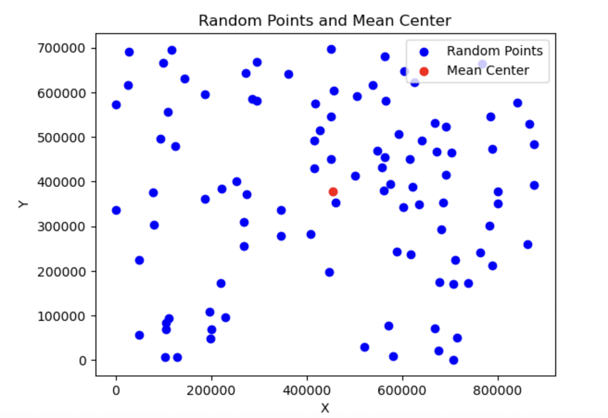
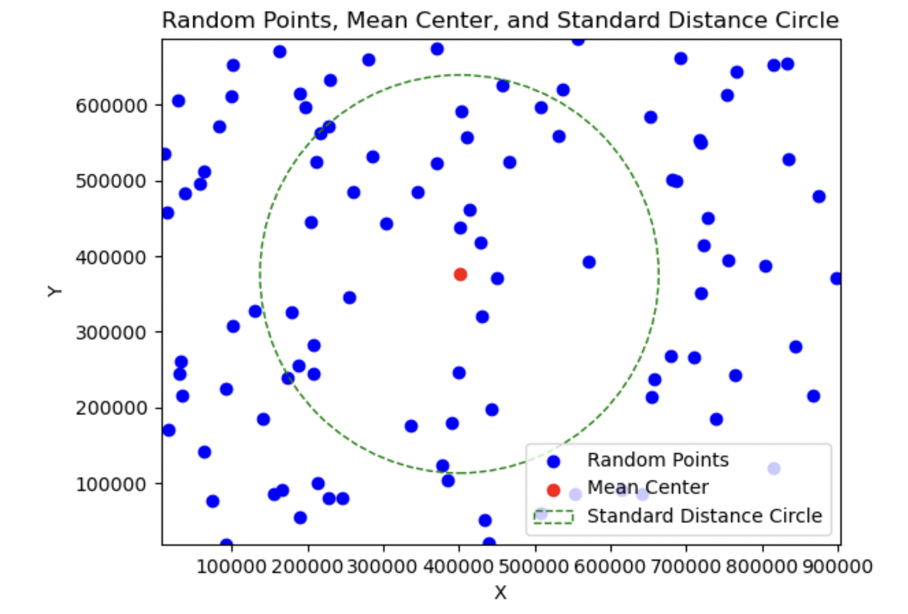

Spatial Analysis
====================

|

Mean Center
-----------

This is a simple script that generates a randon set of x and y coordinates, calculates the mean center of the points, then plots the coordinates of the random points and mean center.  If you haven't looked up numpy's docuentation on its random and mean functions. now might be a good time to do so.

.. code-block:: python

	import numpy as np
	import matplotlib.pyplot as plt

	# Set the number of random points
	num_points = 100

	# Generate random x and y coordinates. These are 1-dimensional array with random values.
	x_coords = np.random.rand(num_points) * 900000
    y_coords = np.random.rand(num_points) * 700000

	# Calculate the mean center
	mean_x = np.mean(x_coords)
	mean_y = np.mean(y_coords)

	# Plot the random points
	plt.scatter(x_coords, y_coords, color='blue', label='Random Points')

	# Plot the mean center point
	plt.scatter(mean_x, mean_y, color='red', label='Mean Center')

	# Set plot title and labels
	plt.title('Random Points and Mean Center')
	plt.xlabel('X')
	plt.ylabel('Y')

	# Add legend
	plt.legend()

	# Display the plot
	plt.show()

|

Mean Center and Standard Distance Circle
-------------------------------------------

These are popular visualization in GIS. 

.. code-block:: python

	import numpy as np
	import matplotlib.pyplot as plt

	# Set the number of random points
	num_points = 100

	# Generate random x and y coordinates
	x_coords = np.random.rand(num_points) * 100
	y_coords = np.random.rand(num_points) * 100

	# Calculate the mean center
	mean_x = np.mean(x_coords)
	mean_y = np.mean(y_coords)

	# Calculate the standard deviation of X and Y coordinates
	std_x = np.std(x_coords)
	std_y = np.std(y_coords)

	# Calculate the radius as one standard deviation
	radius = max(std_x, std_y)

	# Plot the random points
	plt.scatter(x_coords, y_coords, color='blue', label='Random Points')

	# Plot the mean center point
	plt.scatter(mean_x, mean_y, color='red', label='Mean Center')

	# Plot the standard distance circle
	circle = plt.Circle((mean_x, mean_y), radius, color='green', fill=False, linestyle='--', label='Standard Distance Circle')
	plt.gca().add_patch(circle)

	# Set plot title and labels
	plt.title('Random Points, Mean Center, and Standard Distance Circle')
	plt.xlabel('X')
	plt.ylabel('Y')

	# Add legend
	plt.legend()

	# Set axis equal and adjust plot limits
	plt.axis('equal')
	plt.xlim(min(x_coords) - 10, max(x_coords) + 10)
	plt.ylim(min(y_coords) - 10, max(y_coords) + 10)

	# Display the plot
	plt.show()

   

  | 

Mean Center from a Set of Points 
----------------------------------

.. code-block:: python

	import geopandas as gpd
	from shapely.geometry import Point
	import matplotlib.pyplot as plt

	# Path to the points shapefile
	shapefile_path = 'path_to_shapefile.shp'

	# Read the shapefile
	gdf = gpd.read_file(shapefile_path)

	# Calculate the mean center
	mean_center = gdf.geometry.unary_union.centroid

	# Plot the points
	gdf.plot(marker='o', color='blue', markersize=5, label='Points')

	# Plot the mean center
	plt.scatter(mean_center.x, mean_center.y, color='red', s=50, label='Mean Center')

	# Set plot title and labels
	plt.title('Points and Mean Center')
	plt.xlabel('Longitude')
	plt.ylabel('Latitude')

	# Add legend
	plt.legend()

	# Show the plot
	plt.show()

In the script above, GeoPandas uses Shapely geometry objects to represent and manipulate the geometries within a GeoDataFrame.  You can directly call any Shapely geometry methods on the geometry column of a GeoDataFrame. This means that you can utilize the full range of Shapely's geometric operations, such as buffering, intersection, union, difference, and many more, by accessing the geometry column.

|

Spatial Interpolation
----------------------

The script below calculates spatial interpolation using the IDW method.  It is taken from this website - https://www.geodose.com/2019/09/3d-terrain-modelling-in-python.html#google_vignette.

.. code-block:: python

    import numpy as np
    import csv

    # DISTANCE FUNCTION
    def distance(x1, y1, x2, y2):
        d = np.sqrt((x1 - x2)**2 + (y1 - y2)**2)
        return d

    # CREATING IDW FUNCTION
    def idw_npoint(xz, yz, n_point, p, csv_file):
        x = []
        y = []
        z = []

        # Read x, y, z values from the CSV file
        with open(csv_file, 'r') as file:
            reader = csv.reader(file)
            next(reader)  # Skip the header row if present
            for row in reader:
                x.append(float(row[0]))
                y.append(float(row[1]))
                z.append(float(row[2]))

        r = 10  # block radius iteration distance
        nf = 0
        while nf <= n_point:  # will stop when np reaching at least n_point
            x_block = []
            y_block = []
            z_block = []
            r += 10  # add 10 units each iteration
            xr_min = xz - r
            xr_max = xz + r
            yr_min = yz - r
            yr_max = yz + r
            for i in range(len(x)):
                # condition to test if a point is within the block
                if ((x[i] >= xr_min and x[i] <= xr_max) and (y[i] >= yr_min and y[i] <= yr_max)):
                    x_block.append(x[i])
                    y_block.append(y[i])
                    z_block.append(z[i])
            nf = len(x_block)  # calculate the number of points in the block

        # calculate weight based on distance and p value
        w_list = []
        for j in range(len(x_block)):
            d = distance(xz, yz, x_block[j], y_block[j])
            if d > 0:
                w = 1 / (d**p)
                w_list.append(w)
                z0 = 0
            else:
                w_list.append(0)  # if this condition is met, it means d <= 0, weight is set to 0

        # check if there is 0 in the weight list
        w_check = 0 in w_list
        if w_check == True:
            idx = w_list.index(0)  # find the index for weight = 0
            z_idw = z_block[idx]  # set the value to the current sample value
        else:
            wt = np.transpose(w_list)
            z_idw = np.dot(z_block, wt) / sum(w_list)  # idw calculation using dot product
        return z_idw

References
------------

https://www.geodose.com/2019/09/3d-terrain-modelling-in-python.html#google_vignette

