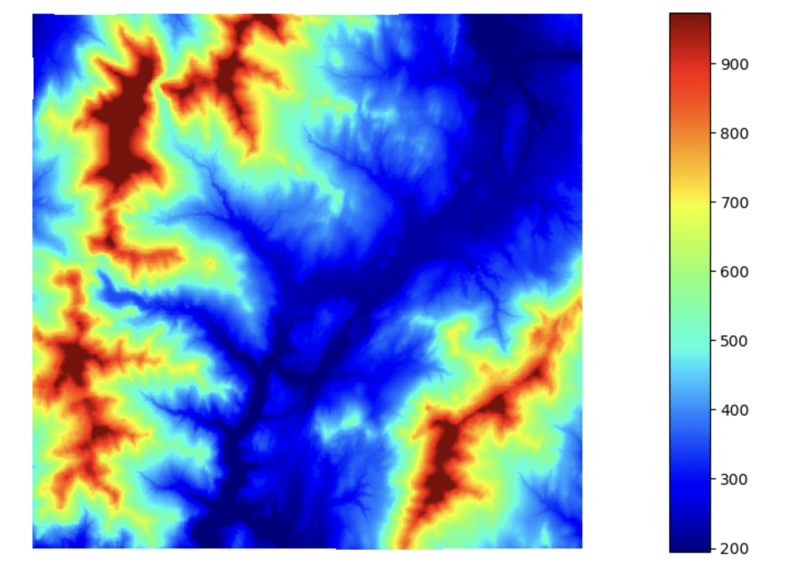
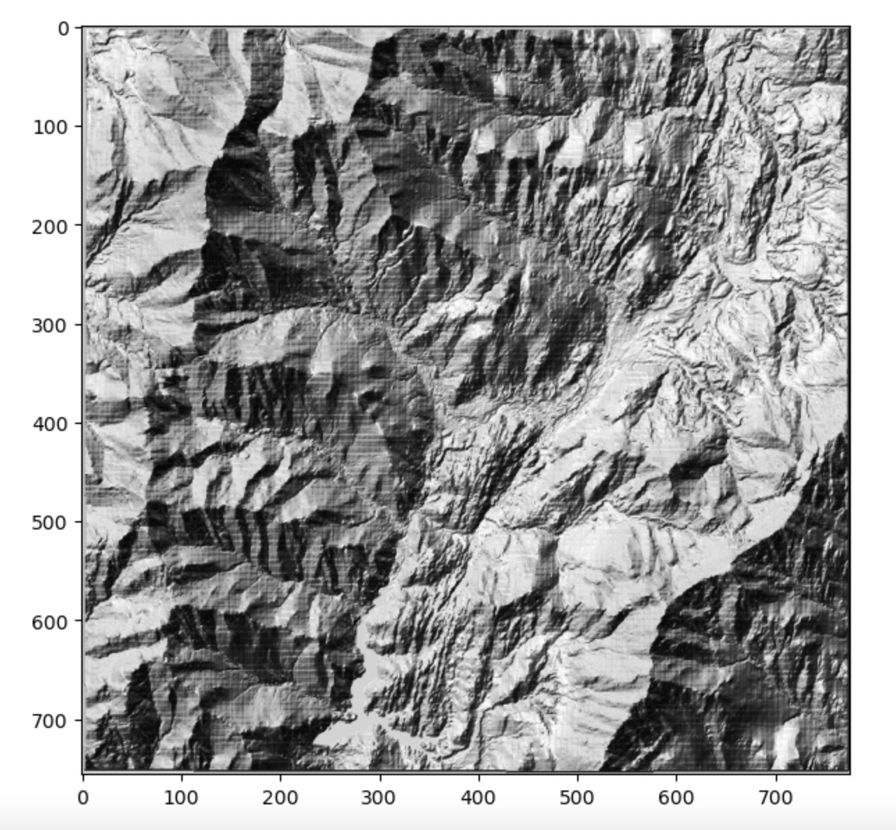
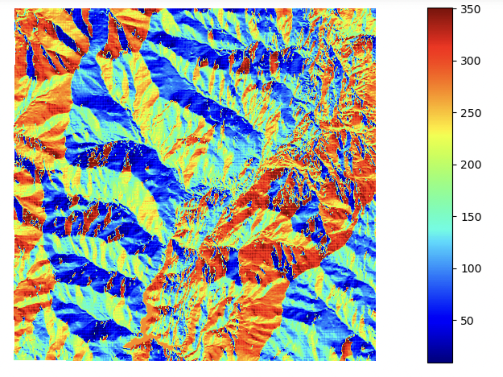

Terrain Analysis
===================

|

There are many python libraries that are available for terrain analysis.  Below, I use Arcpy, RichDEM, Rasterio, GDAL and pysheds for basic terrain analysis.  

|

Displaying DEM
----------------

Terrain analysis starts with displaying digital elevation models.  We have touched on this topic before.  Below, a DEM of Stowe, VT is displayed with the RichDEM library.  

.. code-block:: python

   import richdem as rd
   import numpy as np

   src = rd.LoadGDAL(r'/Users/.../elevation/w001001.adf')

   rd.rdShow(src, ignore_colours=[0], axes=False, cmap='jet', figsize=(8,5.5))

|

Generating Hillshades
----------------------

Hillshades are used in terrain analysis to give elevation data a 3-dimensional appearance thereby making it easier to visualize variations in topography. Hillshades are also frequently used in GIS and Cartography as underlays to make other kinds of data more visually interesting. Google Maps use hillshades extensivelly to portray terrain features of the earth.

|

**Generate Hillshade with ArcPy**

The two scripts below show how to generate hillshade maps using ArcPy within ArcMap or ArcGIS Pro.   

1. Run this script from the ArcPy Window.

.. code-block:: python

	from arcpy.ia import *
	out_hillshade_raster = Hillshade("elevation.tif", 180, 75, 0.3048)
	out_hillshade_raster.save("C:/arcpyExamples/outputs/hillshade.tif")

2.  This example calculates the hillshade using IDLE or any other IDE

.. code-block:: python

	# Import the system modules
	import arcpy
	from arcpy.ia import *

	# Set the analysis environments
	arcpy.env.workspace = "C:/arcpyExamples/data"

	# Set the local variables
	in_dem = "elevation.tif"

	# Execute the Hillshade function
	out_hillshade_raster = Hillshade(in_dem, 180, 75, 0.3048)

	# Save the output
	out_hillshade_raster.save("C:/arcpyExamples/outputs/hillshade.tif")

*Source*
https://pro.arcgis.com/en/pro-app/latest/arcpy/image-analyst/hillshade.htm

|

**Generate Hillshade  using GDAL**

The code sample below shows the details of computing hillshade. 

.. code-block:: python

	from osgeo import gdal
	from numpy import gradient
	from numpy import pi
	from numpy import arctan
	from numpy import arctan2
	from numpy import sin
	from numpy import cos
	from numpy import sqrt
	from numpy import zeros
	from numpy import uint8
	import matplotlib.pyplot as plt

	def hillshade(array, azimuth, angle_altitude):
	        
	    x, y = gradient(array)
	    slope = pi/2. - arctan(sqrt(x*x + y*y))
	    aspect = arctan2(-x, y)
	    azimuthrad = azimuth*pi / 180.
	    altituderad = angle_altitude*pi / 180.
	     
	 
	    shaded = sin(altituderad) * sin(slope)\
	    + cos(altituderad) * cos(slope)\
	    * cos(azimuthrad - aspect)
	    return 255*(shaded + 1)/2

	ds = gdal.Open('/Users/semple/Desktop/topography/dem')   
	band = ds.GetRasterBand(1)  
	arr = band.ReadAsArray()

	hs_array = hillshade(arr,315, 45)
	plt.imshow(hs_array,cmap='gist_earth')
	plt.show()

|

**Generating Hillshade with Earthpy**

.. code-block:: python

	import matplotlib.pyplot as plt
	import earthpy as et
	import earthpy.spatial as es
	import earthpy.plot as ep

	with rasterio.open('/Users/.../topography/dem') as src:
	    elev = src.read(1)
	    
	    
	hillshade = es.hillshade(elev, azimuth=240, altitude=1)

	ep.plot_bands(
	    hillshade,
	    cbar=False,
	    title="Hillshade of Wayne County",
	    figsize=(10, 6),
	)
	plt.show()

For information in earthpy, see https://earthpy.readthedocs.io/en/latest/gallery_vignettes/plot_dem_hillshade.html#sphx-glr-gallery-vignettes-plot-dem-hillshade-py

|

**Elevation Layer Draped on Hillshade using Earthpy and Matplotlib**

In this example, both the elevation layer and the hillshade layer are displayed in a single figure and ax object.

.. code-block:: python

	import matplotlib.pyplot as plt
	import earthpy as et
	import earthpy.spatial as es
	import earthpy.plot as ep
	import matplotlib.colors as colors

	with rasterio.open('/Users/.../elevation/w001001.adf') as src:
	    elevation = src.read(1)
	    
	    
	#extent=[src.bounds[0], src.bounds[2], src.bounds[1], src.bounds[3]]

	hillshade = es.hillshade(elevation, azimuth=240, altitude=10)

	fig, ax = plt.subplots(figsize=(10, 6))
	ep.plot_bands(
	    elevation,
	    ax=ax,
	    cmap="terrain",
	    norm = colors.Normalize(vmin = 0, vmax = src_array.max()),
	    title="Digital Elevation Model (DEM)\n overlayed on top of a hillshade",
	)

	ep.plot_bands(hillshade, 
	              cmap='Greys', 
	              alpha=0.5, 
	              ax=ax, 
	              cbar=False)

	plt.show()

.. image:: img/stowe_elevation_hillshade.png
   :alt: Elevation Layer Draped on Hillshade

|

Slope Mapping
----------------

**Generate Slope Map with Arcpy**

The two scripts below show how to calculate slope using ArcPy.   

1. Run this script from the ArcPy Window.

.. code-block:: python

   import arcpy
   from arcpy import env
   from arcpy.sa import *
   env.workspace = "C:/.../topography" 
   outSlope = Slope("dem", "DEGREE", 0.3043)  # Slope Tool
   outSlope.save("C:/Washtenaw/county/outslope01")

2. Run this script using Idle in Python 2.7 on a machine that has ArcMap, or from Jupyter Notebook in ArcGIS Pro.

.. code-block:: python

   # Import system modules
   import arcpy
   from arcpy import env
   from arcpy.sa import *

   # Set environment settings
   env.workspace = "C:/Washtenaw"

   # Set local variables
   inRaster = "C:/Washtenaw/county/washtenaw/topography/dem"
   outMeasurement = "DEGREE"
   zFactor = 0.3043

   # Check out the ArcGIS Spatial Analyst extension license
   arcpy.CheckOutExtension("Spatial")

   # Execute Slope
   outSlope = Slope(inRaster, outMeasurement, zFactor) # Slope Tool

   # Save the output
   outSlope.save("C:/Washtenaw/county/outslope02")

|

 **Calculate Slope from a DEM using PyQGIS**

.. raw:: html

    <iframe width="560" height="315" src="https://www.youtube.com/embed/2g526ZoMu24" title="YouTube video player" frameborder="0" allow="accelerometer; autoplay; clipboard-write; encrypted-media; gyroscope; picture-in-picture; web-share" allowfullscreen></iframe>

 |

**Generate Slope using the RichDem Library**

First, install the RichDEM library. run the sample script below.

.. code-block:: python

	import matplotlib.pyplot as plt
	import richdem as rd

	#Load Raster
	stowe_dem = rd.LoadGDAL(r'/Users/.../Stowe_DEM.tif')

	#Perform Slope Calculation
	slope = rd.TerrainAttribute(stowe_dem, attrib='slope_riserun')

	#Display slope map
	rd.rdShow(slope, axes=False, cmap='jet', figsize=(10, 6))

.. image:: img/stowe_rich_dem_slope.png
   :alt: Slope Map

|

**Generate Slope using GDAL**

.. code-block:: python

	from osgeo import gdal
	import numpy as np
	import rasterio
	import matplotlib.pyplot as plt

	def calculate_slope(DEM):
	      gdal.DEMProcessing('slope.tif', DEM, 'slope')
	     with rasterio.open('slope.tif') as dataset:
	          slope = dataset.read(1)
	          return slope

	slope=calculate_slope("/Users/student/Desktop/TestDEM.tif")

	plt.imshow(slope, cmap='copper')
	plt.show()

|

Aspect Mapping
-----------------

**Calculate Aspect with Arcpy**

The script below show how to generate an aspect map using ArcPy.   

1. Calculate Aspect

.. code-block:: python

   # Import system modules
   import arcpy
   from arcpy import env
   from arcpy.sa import *

   # Set environment settings
   env.workspace = "C:/sapyexamples/data"

   # Set local variables
   inRaster = "elevation"

   # Execute Aspect
   outAspect = Aspect(inRaster)  # Aspect tool

   # Save the output
   outAspect.save("C:/sapyexamples/output/outaspect02")

|

**Generate Aspect Maps Using the GDAL Library**

.. code-block:: python

	from osgeo import gdal
	import numpy as np
	import rasterio
	import matplotlib.pyplot as plt

	def calculate_aspect(DEM):
	       gdal.DEMProcessing('aspect.tif', DEM, 'aspect')
	              with rasterio.open('aspect.tif') as dataset:
	              aspect = dataset.read(1)
	              return aspect

	aspect=calculate_aspect("/Users/.../TestDEM.tif")

	plt.imshow(aspect, cmap='copper')
	plt.show()

For more information, please see this website - https://richdem.readthedocs.io/en/latest/terrain_attributes.html

|

**Generate Aspect Maps Using the RichDEM Library**

.. code-block:: python

	import matplotlib.pyplot as plt
	import richdem as rd

	dem = rd.LoadGDAL('/Users/.../elevation')

	aspect = rd.TerrainAttribute(dem, attrib='aspect')
	rd.rdShow(aspect, axes=False, cmap='jet', figsize=(7, 5))
	plt.show()

|

Curvature Maps 
------------------

**Generate Curvature Maps using Arcpy**

The two scripts below show how to calculate curvature using ArcPy.  

1. Curvature Example 1. Use in ArcGIS Python Window

.. code-block:: python

	from arcpy.ia import *
	out_curvature_raster = Curvature("curvature_input.tif", "profile", 2)
	out_curvature_raster.save("C:/.../curvature.tif")

|

2. Curvature Example 2

This example calculates the curvature of a given slope. Use in Idle or Python Notebook

.. code-block:: python

	# Import system modules
	import arcpy
	from arcpy.ia import *

	# Set the analysis environments
	arcpy.env.workspace = "C:/arcpyExamples/data"

	# Set the local variables
	in_raster = "curvature_input.tif"

	# Execute Curvature function
	out_curvature_raster = Curvature(in_raster, "planform", 3)

	# Save the output
	out_curvature_raster.save("C:/arcpyExamples/outputs/cur_planform.tif")

Click on this link for more code samples - https://pro.arcgis.com/en/pro-app/latest/tool-reference/spatial-analyst

|

Automating Terrain Analysis Workflows 
---------------------------------------

Python scripts are useful for automating workflows that involves the use of multiple tools either parallel to each other or sequentially.  For example, if your terrain analysis involves producing both a slope map and an aspect map from the same digital elevation model, then these two computations can be integrated into a single script as shown in the example below, where both slope and aspect are computed within the script.

In other occasions, the output of one processing operation becomes the input for another processing operation. This is evident in the watershed delineation 

a. Calculate Slope and Aspect Using a Single Script

.. code-block:: python

   #Import system modules
   import arcpy
   from arcpy import env
   from arcpy.sa import *

   try:
	   # Set environment settings
	   env.workspace = "C:/workspace"
	   # Set local variables
	   inRaster = "dem"
	   outMeasurement = "DEGREE" 
	   zFactor = 0.3043

	   # Check out the ArcGIS Spatial Analyst extension license
	   arcpy.CheckOutExtension("Spatial")

	   # Execute Slope
	   outSlope = Slope(inRaster, outMeasurement, zFactor)
	    
	   # Save the output
	   outSlope.save("C:/workspace/outslope02")
	   print "Slope successfully calculated"      
	     
	   # Execute Aspect
	   outAspect = Aspect(inRaster)
	   outAspect.save("C:/workspace/outaspect02")
	
	except Exception as e:
	    print (e.message)

|

Watershed Delineation
----------------------

In this script, the output of one processing becomes the output of the next process.

**Watershed Delineation with pysheds**

I came across a library called pysheds that can be used for watershed delineation. Tested sample code is presented below.

.. code-block:: python

	from pysheds.grid import Grid

	grid = Grid.from_raster('/Users/.../elevation.tiff')
	dem = grid.read_raster('/Users/.../elevation.tiff')

	# Fill Sinks
	# ----------------------
	# Fill pits in DEM
	pit_filled_dem = grid.fill_pits(dem)

	# Fill depressions in DEM
	flooded_dem = grid.fill_depressions(pit_filled_dem)
	    
	# Resolve flats in DEM
	inflated_dem = grid.resolve_flats(flooded_dem)

	# Determine D8 flow directions from DEM
	# ----------------------
	# Specify directional mapping
	dirmap = (64, 128, 1, 2, 4, 8, 16, 32)
	    
	# Compute flow directions
	# -------------------------------------
	fdir = grid.flowdir(inflated_dem, dirmap=dirmap)

	# Calculate flow accumulation
	# --------------------------
	acc = grid.accumulation(fdir, dirmap=dirmap)

	# Delineate a catchment
	# ---------------------
	# Specify pour point
	x, y = -97.294, 32.737

	# Snap pour point to high accumulation cell
	x_snap, y_snap = grid.snap_to_mask(acc > 1000, (x, y))

	# Delineate the catchment
	catch = grid.catchment(x=x_snap, y=y_snap, fdir=fdir, dirmap=dirmap, 
	                       xytype='coordinate')

	# Crop and plot the catchment
	# ---------------------------
	# Clip the bounding box to the catchment
	grid.clip_to(catch)
	clipped_catch = grid.view(catch)

	# Extract river network
	# ---------------------
	branches = grid.extract_river_network(fdir, acc > 50, dirmap=dirmap)

	# Calculate distance to outlet from each cell
	# -------------------------------------------
	dist = grid.distance_to_outlet(x=x_snap, y=y_snap, fdir=fdir, dirmap=dirmap,
	                               xytype='coordinate')

	

	

Source: http://mattbartos.com/pysheds/

|

Working with GDAL Command Line Utilities
-------------------------------------------

**Getting Information about a Raster**

Let's try the gdalifo command which can be executed from the command prompt. Gdalifo returns a lengthy list of details about the raster.

.. code-block:: python

	>>> $ gdalinfo /Users/.../WhiteadderDEM.tif

	Driver: AIG/Arc/Info Binary Grid
	Files: /Users/.../Desktop/Stowe_Dataset/elevation
	Size is 775, 756
	Coordinate System is:
	PROJCRS["unnamed",
	    BASEGEOGCRS["NAD83",
	        DATUM["North American Datum 1983",
	            ELLIPSOID["GRS 1980",6378137,298.257222101,
	                LENGTHUNIT["metre",1]]],
	        PRIMEM["Greenwich",0,
	            ANGLEUNIT["degree",0.0174532925199433]],
	        ID["EPSG",4269]],
	    CONVERSION["unnamed",
	        METHOD["Transverse Mercator",
	            ID["EPSG",9807]],
	        PARAMETER["Latitude of natural origin",42.5,
	            ANGLEUNIT["degree",0.0174532925199433],
	            ID["EPSG",8801]],
	        PARAMETER["Longitude of natural origin",-72.5,
	            ANGLEUNIT["degree",0.0174532925199433],
	            ID["EPSG",8802]],
	        PARAMETER["Scale factor at natural origin",0.999964286,
	            SCALEUNIT["unity",1],
	            ID["EPSG",8805]],
	        PARAMETER["False easting",500000,
	            LENGTHUNIT["METERS",1],
	            ID["EPSG",8806]],
	        PARAMETER["False northing",0,
	            LENGTHUNIT["METERS",1],
	            ID["EPSG",8807]]],
	    CS[Cartesian,2],
	        AXIS["easting",east,
	            ORDER[1],
	            LENGTHUNIT["METERS",1]],
	        AXIS["northing",north,
	            ORDER[2],
	            LENGTHUNIT["METERS",1]]]
	Data axis to CRS axis mapping: 1,2
	Origin = (470957.412858718482312,231421.559170683787670)
	Pixel Size = (30.680581002795002,-30.680581002795002)
	Metadata:
	  DataType=Generic
	Corner Coordinates:
	Upper Left  (  470957.413,  231421.559) ( 72d51'56.55"W, 44d34'56.75"N)
	Lower Left  (  470957.413,  208227.040) ( 72d51'51.86"W, 44d22'25.30"N)
	Upper Right (  494734.863,  231421.559) ( 72d33'58.68"W, 44d34'58.78"N)
	Lower Right (  494734.863,  208227.040) ( 72d33'57.83"W, 44d22'27.33"N)
	Center      (  482846.138,  219824.300) ( 72d42'56.23"W, 44d28'42.39"N)
	Band 1 Block=256x16 Type=Float32, ColorInterp=Undefined
	  Description = elevation
	  Min=133.493 Max=1335.372 
	  Minimum=134.525, Maximum=1333.913, Mean=476.449, StdDev=214.550
	  NoData Value=-3.4028234663852886e+38
	  Overviews: 388x378, 194x189
	  Metadata:
	    RepresentationType=ATHEMATIC
	    STATISTICS_APPROXIMATE=YES
	    STATISTICS_MAXIMUM=1333.9129638672
	    STATISTICS_MEAN=476.44892214671
	    STATISTICS_MINIMUM=134.52473449707
	    STATISTICS_STDDEV=214.55017815777
	    STATISTICS_VALID_PERCENT=98.84

|

**Converting Between Raster Formats**

We can convert between raster file formats using the gdal_translate tool. Gdal_translate recognises many file formats. To set the file format, use the '-of' flag. An example of the syntax is shown below:

.. code-block:: python

   >>> $ gdal_translate -of ENVI  /Users/student/Downloads/WhiteadderDEM.tif  /Users/hsemple/Downloads/WhiteadderDEM.bil

|

**Clipping Rasters using GDAL**

Clipping rasters can be done quite easily using gdal. You can enter the bounding coordinates of the clipping extent or you can supply a raster or vector file as the extent.

.. code-block:: python

	>>> $ gdalwarp -te <x_min> <y_min> <x_max> <y_max> input.bil clipped_output.bil

|

**Merging Rasters using GDAL**

If you have large DEMs you can merge them very quickly using GDAL 

.. code-block:: python

    >>> $ gdal_merge.py -o out.tif in1.tif in2.tif

   
    #The -o flag indicates the outfile. 

|

**Changing Raster Projections with Gdalwarp**

We can change the underlying projections of rasters using the gdalwarp command.  The gdalwarp command detects the projection of the raster that is to be projected so we do not have enter this value.   The '-t_srs' flag is used to assign the target coordinate system, which must be placed in quotes.  An example of the basic command is shown below:

.. code-block:: python

   >>> $ gdalwarp -t_srs '+proj=utm +zone=44 +datum=WGS84' projected.tif reprojected.tif

See this link for more info: https://www.geos.ed.ac.uk/~smudd/TopoTutorials/html/tutorial_raster_conversion.html#converting-between-formats-using-gdal

|

**Compute Slope**

.. code-block:: python

   >>> $ gdaldem slope inputDem.tif  output_slope.tif

|

**Make a Colored Relief Map**

First, run gdalinfo and get the minimum and maximum elevation of the DEM.  Next, use these values to make some elevation breaks and some corresponding RGB colors for each break. In the example below, the first number in each row represents the upper breakpoint for the color range while the next three values are RGB values.  In the example, echo takes everything between the quotations and places it into a file called color-relief.txt usng the > operator:

| echo '0 0 0 0
| 26 110 220 110
| 51 240 250 160
| 76 230 220 170
| 101 220 220 220
| 127 250 250 250' > color-relief.txt

Once the color map file is completed, we can use it generate a colored relief, as shown in the example below:

.. code-block:: python

    >>> gdaldem color-relief -of PNG sf-dem.tif color-relief.txt sf-dem-coloredRelief.tif

|

For more information on how to work with GDAL cmmand line utilities, see this website - https://gdal.org/programs/gdaldem.html

|

Calling GDAL Commands from Python
----------------------------------

It is possible to call GDAL commands from Python and other scripting languages. This allows for easy iteration through geoprocessing tasks, or integration of geoprocessing steps into complex scripted workflows. 

**Open a Raster with GDAL**

We have already seen this structure in previous Python scripts that used the gdal library.

.. code-block:: python

	from osgeo import gdal
	fn = r" /Users/student/Desktop/Stowe_Dataset/elevation"
	ds = gdal.Open(fn) # 0 (default) read-only, 1 update
	print(type(ds))

|

**Get Raster Properties**

.. code-block:: python

	fn_dem = r"..\data\input\USGS_one_meter_x64y486_ID_FEMAHQ_2018.tif"
	fn_img = r"..\data\input\m_4311515_ne_11_1_20150908_20160104.jp2"
	ds = gdal.Open(fn_dem) # 2 arguments: (file name, access type: 0 (default) read-only, 1 update)
	
	nrows = ds.RasterYSize
	ncols = ds.RasterXSize
	proj = ds.GetProjection()  # returns WKT definition
	nbands = ds.RasterCount
	geot = ds.GetGeoTransform()

|

Exercises
-----------

1. Write a script that prompts the user for the path to input DEM and an input satellite imagery.  Afterwards, the script should generate a hillshade of the area. Finally, the script should drape the satellite imagery over the hillshade.

2. Instead of generating a hillshade, write a second script to generate a 3D model of the area. Afterward, let the script drape a satellite imagery over the 3D model of the area.

**Resources**

Please visit the link below for a sample script. Note: This is just one way of approaching this task.

https://subscription.packtpub.com/book/big-data-and-business-intelligence/9781783555079/10/ch10lvl1sec73/draping-an-orthophoto-over-a-dem

