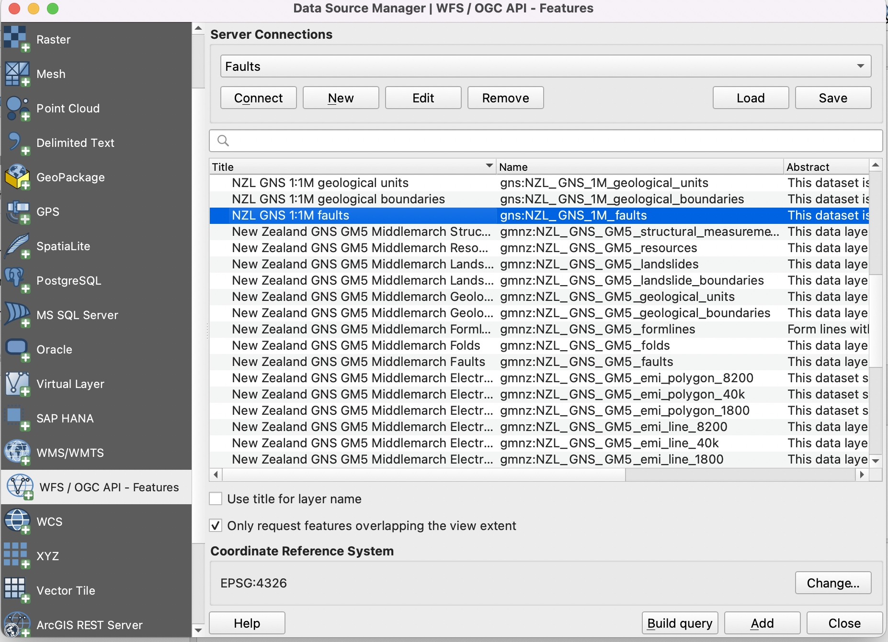

Development Environments
==========================

For these tutorials, we will run Python in the following development environments: The Standard Python Distribution, Anaconda Distribution, ArcGIS Pro, ArcGIS APII for Python, and QGIS. 

|

The Python Core Distribution 
--------------------------------- 

Many people still use the core Python distribution to run their code. However, by default this distribution lacks many packages and their dependencies  that you will need for GIS so you will have to install them manually. 

1. To download the Python Core Distribution, visit Python's `homepage <https://www.python.org/downloads/>`_. Download the latest version.

2. After downloading, install the program on your computer.

 .. image:: img/install_python.png
   :alt: Install Python

3. Follow the `instructions <https://aaronstannard.com/how-to-setup-a-proper-python-environment-on-windows/>`_ on this page to do the following:

  a. Add the Python 2.7 Directory to your System Path Environment Variable. ...
  b. Install pip to Manage Your Python Packages. 
  c. Install virtualenv to Create Local Python Environments for Your Projects.

   
4. To begin entering code into Python, start the Python Interpreter or IDLE.  IDLE is an integrated development environment  that lets you create and edit Python scripts. 

 .. image:: img/interpreter_idle.png
   :alt: Install Python

5. To install new packages, you need to install Pip.  Click `this link <https://phoenixnap.com/kb/install-pip-windows>`_ to learn more about how to work with Pip.  

|
 

 
Jupyter Notebook in Anaconda 
-------------------------------

Anaconda is a large Python distribution that has become very popular over the last several years.  One reason for its popularity is that it comes with many packages already pre-installed. Also, users can run their code using Jupyter Notebook, which is a nice, browser-based environment for running code. I strongly recommend that you use Jupyter Notebook for your Python GIS programming.

1. Download the Anaconda Distribution at `this site <https://www.anaconda.com/products/distribution>`_. 

2. Start Anaconda, then launch the Jupyter Notebook. 

 .. image:: img/jupyter_notebook.png
   :alt: Install Python

3. Click on this `link <https://www.edlitera.com/en/blog/posts/guide-how-to-start-jupyter-notebook#mcetoc_1gcqvj0h63>`_ for information on how to open a Jupyter Notebook on Mac OS or Windows.  The Jupyter development environment should appear as shown below.

 .. image:: img/jupyter_dev_environment.png
   :alt: Install Python

4. If you need to install a new package, open the Anaconda folder in Windows, look for Anaconda prompt.  When the Anaconda prompt starts, enter the command below to search for an install a new package. Conda installs many packages with ease, so you should use it often.

           conda install package_name

5. Alternatively, you can install new packages from within Anaconda Navigatot.

 .. image:: img/install_packages.png
   :alt: Install Python

 
|

Jupyter Notebook within ArcGIS Pro
-------------------------------------

1. If you have ArcGIS Pro installed on your computer, you can run Python using Jupyter Notebook that is installed with ArcGIS Pro.  This is a good development environment to use  as the connection between Python and Jupyter Notebook is already configured.   

2. To run Python using Jupyter Notebook that is installed with ArcGIS Pro, open ArcGIS Pro, then click on Project | Python | Python Notebook, This shown in the illustration below.

 .. image:: img/python_notebook.png
   :alt: Python's Notebook in ArcGIS Pro 

3. If you wish to add new libraries to ArcGIS, you will first have to clone Python's default environment in ArcGIS Pro then install the new libraries to the cloned environment.  This `ESRI tutorial <https://support.esri.com/en/technical-article/000020560>`_shows  how to clone Python's default environment within ArcGIS Pro.
 

 

|

Python Window in ArcGIS Pro 
-----------------------------

1. In ArcGIS Pro, select the Analysis tab. Depending on your version of ArcGIS Pro, you will be able to select the Python Window. As shown below, in Python 2.7, you can click the drop-down menu to the right of the Python button and click Python Window. In other versions, or you may just have to click on the Python Window.
  

 .. image:: img/new_jupyter_notebook.png
   :alt: New Python Notebook

  
 
 2. This opens the Python window.
   

 .. image:: img/arcgis_python_window.png
   :alt: ArcGIS Python Notebook

3. The top section of the Python Window is called the transcript, and the bottom section is called the prompt. The transcript is initially blank. The transcript provides a record of previously entered code and its results.

4. The prompt is where you type your code. When the Python window first opens, the message in the prompt reads Initializing Python interpreter, which means the window is getting ready to receive your code. After a few seconds the message is replaced with Enter Python code here, which means you can start typing your code. After you have opened the Python window for the first time, these messages don’t appear again in the current session.
See this link for a tutorial.
 

|

ArcGIS API for Python
-----------------------

The ArcGIS API for Python is distributed as a conda package named *arcgis*. It can be run from within Anaconda and other Python Distributions.  See this `hyperlink <https://developers.arcgis.com/python/guide/install-and-set-up/>`_ for more information. 

|

The Python Console within QGIS
---------------------------------

**Running Python from the Console Shell**

1. Open QGIS and add this WFS layer. To do so, click on Add Layer | Add WFS Layer..., then select New and provide this URL: https://maps.gns.cri.nz/geology/wfs

2. Highlight the layer called NZL_GNS_250K_faults and select Add Layer to Project. 

3. From the main menu in QGIS, select Plugins | Python Console.  This will cause the Python Console to appear. It may open up towards the bottom of the application, however, if you wish, you can detach it from the main window and place it whereever you wish.

4. The lower part of the Console display with the >>> prompt. This is is where you type commands.  

5. The Python commands can be pure Python commands that have nothing to do with GIS or QGIS, or they can be Python commands ained at manipulating QGIS commands or user data.

6.  The iface class is used to access most graphical QGIS components. For example, to get a reference to the active layer, we can write:   

   >>> layer = iface.activeLayer()

7. Once you get a reference to the active layer object, you can access methods and properties associated with this object. For example, to get the name of the active layer, we write:
   
   >>> layer.sourceName()

8.  You should get the response in the upper half of the console

     'NZL_GNS_250K_faults'

9. Now, let us get a count of the number of features in the layer:

>>> layer.featureCount()

|

**Accessing the QGIS Python Editor**

1.  The editor is used to write scripts that would be too lengthy to run from the Console Shell.   It can be accessed by right-clicking Show Editor in the upper part of the console.

2.  We will write a simple script to print the names of the fields in the attribute table of the WFC layer ::

      layer = iface.activeLayer()

      for fld in layer.fields():
          print(fld.name())

.. image:: img/python_script1.png
   :alt: Python Script Print Name of Attribute Fields

3. The script below get the length of each fault segment and maintains keeps a running total of the lengths ::

    layer = iface.activeLayer()
    lengths = []
    for fault in layer.getFeatures():
        lengths.append(fault.attribute("shape_len"))
        print(sum(lengths))

|

Jupyter Notebook with QGIS
-----------------------------

1. It is possible to run Jupyter notebook from within QGIS.  First, you must install the pyqgis modules into an environment. After than, you can with QGIS outside of the application itself. 

2. Create a Python GIS environment  - https://autogis-site.readthedocs.io/en/latest/course-info/create-python-gis-environment.html

|

Resources
------------

Getting Started With Python Programming (QGIS3) - https://www.qgistutorials.com/en/docs/3/getting_started_with_pyqgis.html

Customizing QGIS with Python (Full Course Material) - https://courses.spatialthoughts.com/pyqgis-in-a-day.html

Free and Open Source GIS Ramblings - https://anitagraser.com/pyqgis-101-introduction-to-qgis-python-programming-for-non-programmers/

GIS Python API documentation - https://qgis.org/pyqgis/master/

PyQGIS Developer Cookbook - https://docs.qgis.org/3.16/en/docs/pyqgis_developer_cookbook/index.html

Streamlining GIS with Automation - https://www.geospatialworld.net/prime/technology-and-innovation/streamlining-gis-with-automation/

Getting started with Anaconda - https://docs.anaconda.com/anaconda/user-guide/getting-started/#open-nav-mac

 

