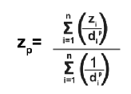

Introduction the Python Language
==================================

Python is an open-source programming language that can be used for a wide variety of programming tasks, from basic scripts to complex and intricate applications.

Python is an interpreted language. This means that the program code is compiled into machine readable code at the moment it is run by the  interpreter.  This is in contrast to a compiled language like C++, or Java where the program code is compiled into machine readable code by a language compiler before the code is run. The compiler creates an executable in the machine's native language that can then be run many times.   

Python is dynamically typed (i.e. you don’t have to declare variables; just assign a value to a variable), case sensitive (i.e. var and VAR are two different variables) and object-oriented (i.e. everything is an object).

Python is made up of  core modules, plus hundreds of specialized libraries, e.g., SciPy, Numpy, Arcpy, etc.

In this module, we will look at the following aspects of the Python language:

* Hello World
* Variables
* Data Types
* Comments
* Basic Python Statements
* Simple programs 

|

**Hello World**

>>> print('Hello, world!')
Hello, world!

|

**Variables**

In programming, a variable is a piece of information stored in the computer’s memory. Think of it as a container for storing values used in a program
Values are assigned to variables using the assignment operator “=“.  
  
>>> my_age = 29           
>>> P1 = input("Please input the size of the first city: ")

Many programming languages require variables to be declared before being assigned a value and used in the program.  Python does not require a variable to be declared.  A variable is created the moment you first assign a value to it.  To initialize a variable in Python, we create a name for the variable and then assign it a value in one statement. The values stored in variables may change during the course of program execution. Please note that Variables are case sensitive. 

Although a variable need not be assigned to any particular data type, if you want to specify the data type of a variable, this can be done with casting. For example:. 

.. code-block:: python
    :linenos:
     
    x = str(10)      # x will be '10'
    y = int(55)      # y will be 55
    z = float(3.8)   # z will be 3.8

|

**Data Types**

Python has several data types. The list below comes from W3Schools.  

* Numeric Types: 	    int, float, complex
* Sequence Types: 	list, tuple, range
* Mapping Type: 	    dict
* Set Types: 	        set, frozenset
* Boolean Type: 	    bool
* Binary Types: 	    bytes, bytearray, memoryview
* None Type: 	        NoneType

*Integers*

1. Integers are whole numbers, i.e., numbers without decimals, e.g, 23, 123, 4567, etc 

2. Integers are assigned to variables using the "=" sign.
   ...  a = 10    # Normal assignment

3. Convert a number to integer
     int(3.45)
     >>> 3

*Floats*

1. Floats are numbers that include decimals

2. To make sure a variable becomes a float, use a decimal somewhere in the declaration/calculations, e.g., 
 
   >>> pi = 3.1415927
   >>> f = 5.0 # declare float

3. To convert a number to a float, use the float function, e.g.,

     >>> float(3)
          3.0

|

**Comments**

*Single Line Comments*

Comments are plain English descriptions of what your code is doing. Comments make it easy for you to debug, maintain and update your code. In Python, single line comments start with ‘#’

 .. code-block:: python
    :linenos:
    
    #Get the user's input
    P1 = input("Please input the size of the first city: ")
     
    #Calculate the interaction ,with output of decimal format
    PI= (int(P1)*int(P2))/(float(Distance)*float(Distance))

*Multiple Line Comments*

You can create multi-line strings with triple quotes (triple double quotes work, too. 

.. code-block:: python
    :linenos:

    ''' I'm very long-winded and I really need to take up more than one line. 
    That way I can say all the very important' things which I must tell you.  
    Strings like me are useful when you must print a long set of instructions, etc.'''      

    P1 = input("Please input the size of the first city: ")
    PI= (int(P1)*int(P2))/(float(Distance)*float(Distance))

|

**Program Statements**

A program statement is a block of code that expresses some action to be carried out. The program statement below converts kilometers into miles.

.. code-block:: python
    :linenos:

    kilometer = float (input ("Please enter the kilometer to covert))
    conversion_ratio =0.621371 
    miles = kilometer * conversion_ratio 
    print ("The converted value is:  ", miles) 

 

|

Please vist the websites below to learn about the Python concepts listed above.

* `Python Basics <https://automatetheboringstuff.com/2e/chapter1/>`_

* `Variables expressions and statements <http://www.openbookproject.net/thinkcs/python/english2e/ch02.html>`_

* `Your first program <https://greenteapress.com/thinkpython2/html/thinkpython2002.html>`_

* `Free Books <https://pythonbooks.revolunet.com/>`_

|

Practice Programs 
------------------

The scripts below are intended to show how to use Python statements to create programs.  The programs are all sequential meaning that each line in the program is run after the preceding line.  Also there is no testing of conditions or repeating of operations.

The first nine program examples do not require any specialized Python packages. They can all be run using Python's standard library. If you do not have a Python' interpreter already installed, you can can use the interpreter at this `website <https://www.programiz.com/python-programming/online-compiler/>`_

For examples 10 through 12, the arcpy package must be loaded into memory using the import statement. If arcpy is not installed, the scripts will return an error.

1. **Write a program to calculate the average of three scores**

Key functions in the program below are the inpt function, the float function, and the round function.

 .. code-block:: python
    :linenos:

    num1 = float(input("Enter the first number: "))
    num2 = float(input("Enter the second number: "))
    num3 = float(input("Enter  the third number: "))

    average = (num1 + num2 + num3) / 3
    print ("the average score is: ", round(average,2))

 |

**2. Write a program that converts the temperature in Fahrenheit to Celsius**

# Note the formatting of the results in the print statement.  str(round(Celsius,2)) converts formats the results to two decimal places then converts the value to a string.   The plus sign concatenates or joins the first string with the second second string.

.. code-block:: python
   :linenos:

   Fahrenheit = float(input("Enter the temperature in Fahrenheit: "))
   Celsius = (Fahrenheit - 32) * 5.0/9.0
   print (str(round(Celsius,2)) + " degrees Celsius")

 

Note:

We can format the output even more as shown in the example below.

.. code-block:: python
   :linenos:

   Fahrenheit = float(input("Enter the temperature in Fahrenheit: "))
   Celsius = (Fahrenheit - 32) * 5.0/9.0
   print (str(round(Fahrenheit,2)) + " degrees Fahrenheit = " + str(round(Celsius,2)) + " degrees Celsius")

|

**3. Write a program to calculate the square root of a number**

In the code below, %0.2f and %0.4f' are formatted place holders for two variables. The variables appear at the end of the string in the form of a tuple preceded by a % sign. 

.. code-block:: python
   :linenos:

   num = float(input('Enter a number: '))
   num_sqrt = num ** 0.5
   print ('The square root of', num, 'is', num_sqrt)

|

**4. Write a Python Program to find the area of triangle**

.. code-block:: python
   :linenos:

   #This program also illustrates the use of format strings (%0.2f)  to format the output. 

   # Get inputs from the user
   base = float(input('Enter length of the base of the triangle: '))
   height = float(input('Enter the height of the triangle '))

   # calculate the area of the triangle
   triangle_area = (base * height) / 2

   # Display the results
   print ('The area of the triangle is',  triangle_area)

|

**5. Write a program that calculates the spatial interaction between two places using a simple form of the gravity model.**

.. image:: img/interaction.png
   :alt: Spatial Interpolation Concept

   
The example code is given below.

.. code-block:: python
   :linenos:

   print ("Welcome to the gravity model calculation program")
   print ("------------------------------------------------")
   print ("")

   #Get the user's input
   P1 = input("Please input the size of the first city: ")
   P2 = input("Please input the size of the second city: ")
   Distance = input("Please input the distance between the two cities: ")
  
   # Calculate the interaction ,with output of decimal format
   PI = (int(P1)*int(P2))/(float(Distance)*float(Distance))

   #Print the result
   print (”The potential interaction between the two cities is", round(PI,2) )   
 
   #End of the program
   print ("Thanks for using this program...")

|

**6. String formatting with the format method**

Curly braces can serve as place-holders for the variables you would like to store inside a string. In order to pass variables to a string you must call upon the .format() method.

.. code-block:: python
   :linenos:

   fname = "John"
   lname = "Doe"
   age = "24"

   print ("{} {} is {} years old." .format(fname, lname, age))

John Doe is 24 years old.

Note: For the print statement, you can also use the line below where the number indicate the position of the placeholders

print ("{0} {1} is {2} years old." .format(fname, lname, age))

|

**7. Write a program to calculate the area of a circle**

The script below illustrates how to import a library (math) and use a function from the math library. Note that the dot notation is used to show that the pi function is related to the math library. 

.. code-block:: python
   :linenos:

   # Get inputs from the user
   import math
   radius = float(input("Enter the radius of the circle: "))
 
   circle_area = math.pi * radius ** 2

   # Display the results
   print('The area of the circle is', circle_area)

|

**8.  Write a Python program to display calendar of given month of the year**

The script below illustrates how to import the calendar library and use a function from the calendar library.

.. code-block:: python
   :linenos:

   import calendar

   # Get the month and year from the user
   yy = int(input("Enter year: "))
   mm = int(input("Enter month: "))

   # display the calendar
   print(calendar.month(yy, mm))

|

**9. Write a program to create a time stamp**

.. code-block:: python
   :linenos:

   #Note the use of concatenation, i.e., the use of the plus sign to join strings to create a single string.

   from datetime import datetime  
   now = datetime.now()
   mm = str(now.month)
   dd = str(now.day)
   yyyy = str(now.year)
   hour = str(now.hour)
   mi = str(now.minute)
   ss = str(now.second)

   print (mm + "/" + dd + "/" + yyyy + " " + hour + ":" + mi + ":" + ss)

|

Exercises
------------

*1. Write a program that calculates the spatial interaction between two places using a simple form of the gravity model*
In the formula below P1 and P2 are the population of the two places while *d* is the distance between the places.*

.. image:: img/interaction.png
   :alt: Spatial Interpolation Concept

|

*2. Write a program that interpolates a single point value using the IDW method*

As shown in the illustration below, we are trying to estimate a value for the unknown point (?) based on the nearest four surrounding values. Instead of calculating a simple average, we are weighting each z-value by the inverse of the distance between the location of the  z-value and the location of the point whose z-value is being calculated.

.. image:: img/interpolation.png
   :alt: Spatial Interpolation Concept

In terms of program flow, your program should prompt the user for each of the known points, zi.  (Tip: repeat the input statement z-values four times).  Next, it should also prompt the user for the distance of each of the z-value to the point that is being calculated (Tip: repeat the input statement for distance values four times).   Once all the z-values and distances are collected, the program should use these values along with the formula below to compute the z-value at the unknown location.   Demonstrate that your program works using the data in the above diagram.

Formula for Spatial Interpolation

|

3. Write a Python program that calculates population growth using the formula below. The programm will first prompt the user for a current population as an integer, a specific growth rate as a floating point number, and the number of years for which growth is to be calculated as an integer. For each successive year, the program will output an estimate for the size of the new population to within an accuracy of two decimal places (it is not necessary to print trailing zeros, and you can use the round() function). Finally, the program should print out the total growth in population.

.. image:: img/population_growth.png
   :alt: Population Growth Formula

|

4. Run the program below that plots average montly temperature values for Ypsilanti for 2022. The programs depends on a library called matplotlib to do the graphing. If matplotlib is not installed on your computer the program will fail. Therefore, you must first install matplotlib for the program to work. Matplotlib is installed with Jupyter Notebook, therefore, one option is run this program within Jupyter Notebook. 

.. code-block:: python
   :linenos:

   import matplotlib.pyplot as plt

  
   x = ['Jan', 'Feb', 'Mar', 'Apr', 'May', 'Jun', 'Jul', 'Aug', 'Sep', 'Oct', 'Nov', 'Dec']
   y = [31,35,46,59,71,80,84,82,75,62,48,36]
   plt.plot(x,y)
   plt.ylabel('Average Monthly Temperature (°F), Ann Arbor, MI')
   plt.show()

|

*5. Buffer a line using Jupyter Notebook*

The program below depends on an ESRI library called arcpy.  It is the arcpy library that supplies the additional capability that Python needs to execute ArcGIS commands. The code is intentended to run as a standalone script or from Jupyter Notebook within ArcGIS Pro.  Copy the script and paste it into Jupyter Notebook within ArcGIS Pro and run it. 

.. code-block:: python
   :linenos:

   import arcpy
   arcpy.env.overwriteOutput = True
   arcpy.env.workspace = "C:/data"
 
   # Get the input parameters for the Buffer tool
   infile = "cities.shp"
   outfile = "buffered_cities.shp"
   bufferDistance = 100
 
   # Run the Buffer tool
   arcpy.Buffer_analysis(infile, outfile, bufferDistance)
 

   # Report any error messages that the Buffer tool might have generated    
   arcpy.AddMessage(arcpy.GetMessages())

|

*6. Buffer a line using the Python Window in ArcGIS Pro*

The code below is written for the arcpy environment and is intentended to be run in ArcGIS Pro Python Window.  Copy the script and paste it into the Python Window.

.. code-block:: python
   :linenos:

   import arcpy
   arcpy.env.workspace = "C:/data"
   arcpy.Buffer_analysis("roads", "C:/output/major_roadsBuffered", "100 Feet", "FULL", "ROUND", "LIST", "Distance")

|

**Deliverables**

Submit the source code of your programs as well as screenshots showing that the programs successfully ran in Python.

